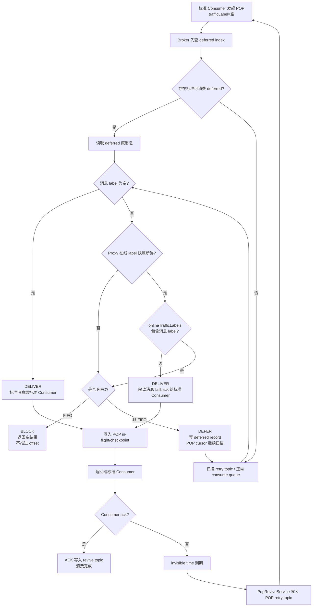
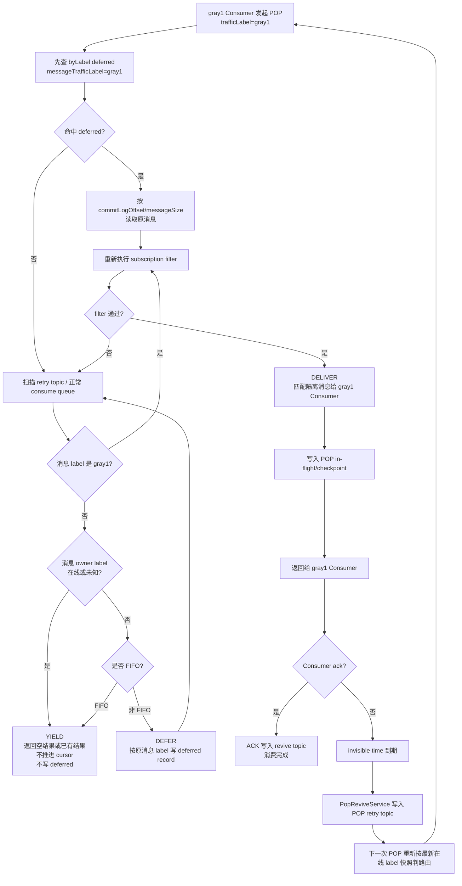
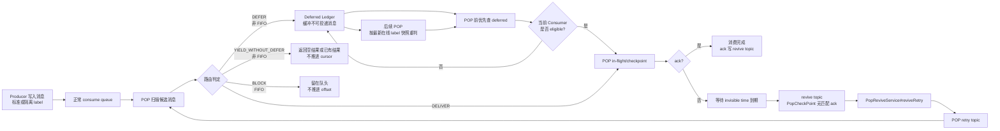
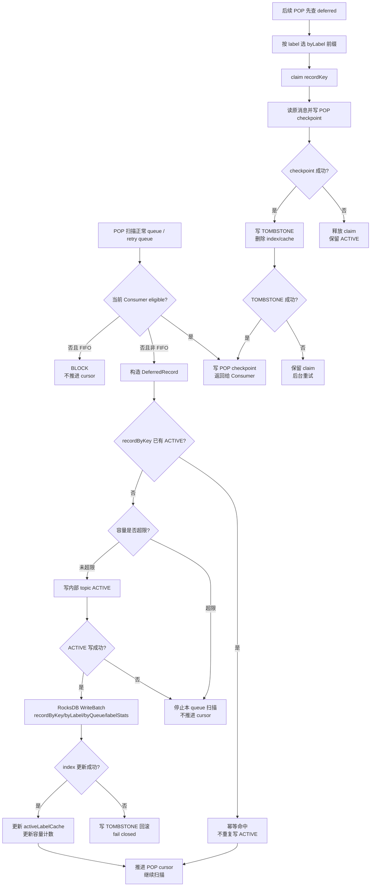
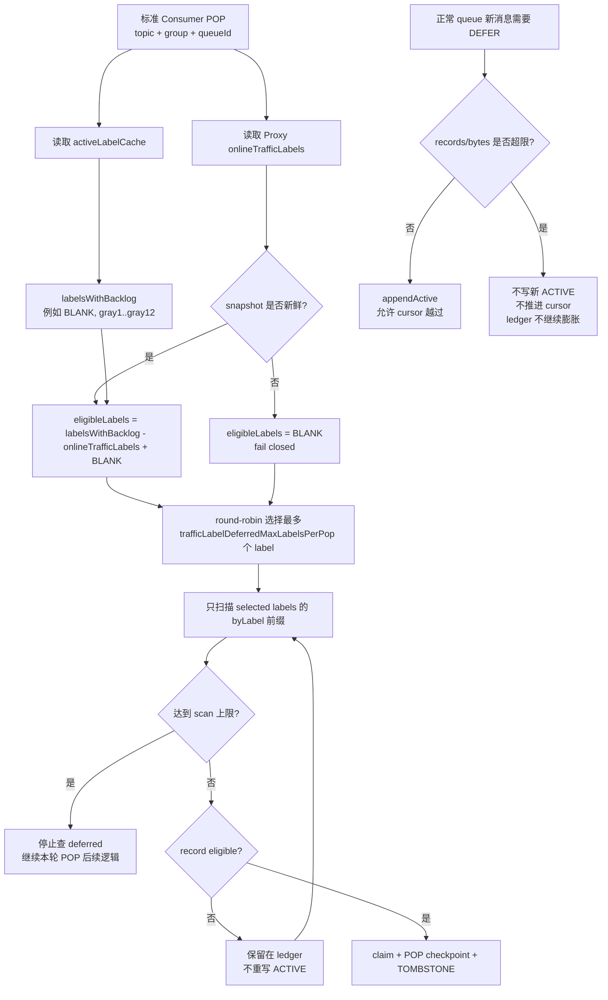

# 流量标动态路由实现计划

> **For Claude:** REQUIRED SUB-SKILL: Use superpowers:executing-plans to implement this plan task-by-task.

**目标：** 基于消息流量标实现动态消费路由：隔离环境 Producer 发送带标消息；如果同一消费组内存在相同隔离标的在线隔离消费者，则由该隔离环境消费；否则回退到标准环境消费。

**架构：** Topic 和 consumer group 维持同一套逻辑资源，不为每个隔离环境拆 Topic 或拆组。Java 5.x Client 负责把 Producer 消息流量标和 Consumer 环境流量标传到 Proxy；多 Proxy 下复用 Cluster Proxy 已有的 Consumer 集群视图，在其上维护 `group/topic/trafficLabel` 在线视图，并在 POP 请求中携带快照；Broker 负责最终路由判断，因为 offset、POP 不可见时间、重试、DLQ、FIFO 顺序都在 Broker 侧闭环。非 FIFO POP 只在 owner-aware 规则允许时通过持久化 deferred ledger 跳过暂时不属于当前消费者的消息，避免隔离 Consumer 把大量标准流量写入 deferred ledger；FIFO 保持全局队列顺序，队头消息不属于当前消费者时只能阻塞。

**技术栈：** RocketMQ Java 5.x Client、RocketMQ Proxy gRPC v2、Broker POP 消费链路、remoting header、Proxy heartbeat syncer、Broker commitlog-backed 内部主题或等价 HA 持久化存储。

---

## 已确认语义

- 标准环境的 `trafficLabel` 为空字符串。
- Broker 和 Proxy 内部把空字符串归一化为 `STANDARD` 哨兵值；协议字段仍可保持空字符串，避免旧客户端兼容问题扩散到业务逻辑。
- 隔离环境的 `trafficLabel` 为非空字符串，例如 `gray1`。
- 隔离 Producer 发送消息时写入消息属性：`__RMQ_TRAFFIC_LABEL=<label>`。
- 隔离 Consumer 通过客户端配置声明自身环境：`trafficLabel=<label>`。
- 无流量标消息只由标准环境 Consumer 消费。
- 有流量标消息在同一逻辑 consumer group 内存在相同在线隔离 Consumer 时，由对应隔离 Consumer 消费。
- 如果消费时没有相同流量标的在线隔离 Consumer，有流量标消息回退给标准环境 Consumer。
- v1 范围覆盖 Java 5.x + Proxy。未携带 consumer label 的旧 remoting 客户端按标准环境处理。
- 非 FIFO 消费允许标准消息越过当前被隔离环境占用的有标消息。
- 非 FIFO 的 deferred ledger 不是任意 non-owner 都能写入。标准 Consumer 可以为在线隔离 label 创建 deferred record；隔离 Consumer 遇到在线标准环境消息时只返回空结果、不推进 cursor、不写 deferred，等待标准 Consumer 消费。
- FIFO 消费必须保持全局队列顺序。如果队头消息属于另一个在线隔离标，非 owner Consumer 返回空结果并等待 owner 消费或 owner 下线。

## 核心路由、跳过与重试语义

### 路由判定模型

Broker 在每次消息即将投递给 Consumer 前实时判定路由，不把某条消息永久绑定给某个环境。判定输入包括：

- 消息上的 `messageTrafficLabel`，来自 `__RMQ_TRAFFIC_LABEL`。
- 当前拉取请求上的 `consumerTrafficLabel`，来自 `PopMessageRequestHeader.trafficLabel` 或 `PopLiteMessageRequestHeader.trafficLabel`。
- 当前 Broker 可用的在线 Consumer label 集合。Java 5.x + Proxy 路径优先使用 POP 请求中由 Proxy 携带的集群在线 label 快照；直连 remoting 路径才使用 Broker 本地 `ConsumerManager` 可见的活跃 Consumer 连接。

判定规则：

```text
if messageTrafficLabel is blank:
    only standard consumer is eligible
else if consumerTrafficLabel == messageTrafficLabel:
    matching isolation consumer is eligible
else if consumerTrafficLabel is blank and no online consumer has messageTrafficLabel:
    standard consumer is eligible by fallback
else:
    current consumer is not eligible; route action decides DEFER or YIELD
```

这里的“没有在线隔离 Consumer”必须以新鲜的集群在线 label 视图为准。隔离 Consumer 进程突然退出时，系统需要等 channel close、unregister 或 heartbeat/lease 过期后才认为它离线；在这之前仍按隔离 Consumer 在线处理。

是否写 deferred ledger 由 route action 决定：

```text
routeAction(messageLabel, consumerLabel, labelState):
    messageLabel = normalizeBlankAsStandard(messageLabel)
    consumerLabel = normalizeBlankAsStandard(consumerLabel)

    if messageLabel == consumerLabel:
        return DELIVER

    if consumerLabel == STANDARD:
        if labelState(messageLabel) == OFFLINE:
            return DELIVER_FALLBACK
        if nonFifo:
            return DEFER
        return BLOCK

    if labelState(messageLabel) == ONLINE or labelState(messageLabel) == UNKNOWN:
        return YIELD_WITHOUT_DEFER

    if nonFifo:
        return DEFER
    return BLOCK
```

`YIELD_WITHOUT_DEFER` 的含义是本次 POP 返回空结果或已有结果，不推进当前 queue cursor，也不写 deferred record。这个非对称规则用于保护标准环境：10 个隔离 Consumer 和 1 个标准 Consumer 同组时，标准消息不会因为被隔离 Consumer 频繁扫到而大量进入 deferred ledger。

### Broker 如何判断某个 label 在线

Broker 不主动扫描全量 Consumer，也不假设自己能看到所有 Consumer。Broker 只在单次 POP 路由决策里判断“本次请求上下文中，`gray1` 是否在线”。

Java 5.x + Proxy 路径的判断来源：

1. Consumer 连接到某个 Proxy 时，Proxy 从 `x-mq-traffic-label` 得到 Consumer 环境 label，并把空值归一化为 `STANDARD`。
2. Proxy 通过 `TrafficLabelPresenceManager` 维护本地和远端 Proxy 同步来的 Consumer lease。实现上复用 Cluster Proxy 已有的 `ClusterConsumerManager`、`HeartbeatSyncer`、`RemoteChannel` 机制，不另建第二套 Consumer registry。
3. Proxy 发起 POP 请求 Broker 前，按 `consumerGroup/topic` 查询 presence manager，生成在线 label 快照：
   - `onlineTrafficLabels`
   - `trafficLabelSnapshotTimestamp`
   - `trafficLabelSnapshotVersion`
4. Broker 收到 POP 请求后先校验快照是否可用：
   - `onlineTrafficLabels` 字段存在。
   - `trafficLabelSnapshotTimestamp` 未超过 `trafficLabelRoutingMaxSnapshotAgeMs`。
   - snapshot version 可用于日志和排查。
5. 快照可用时，Broker 用归一化后的 label 集合判断 owner 是否在线。标准环境也必须出现在快照中，例如内部哨兵值 `STANDARD`；否则 Broker 无法判断隔离 Consumer 扫到标准消息时是否应该 `YIELD_WITHOUT_DEFER`。
6. 快照缺失或过期时，状态为 `UNKNOWN`，标准 Consumer 不允许 fallback；非 FIFO 走 `DEFER`，FIFO 走 `BLOCK`。

伪代码：

```text
labelState(messageTrafficLabel, routeContext):
    messageTrafficLabel = normalizeBlankAsStandard(messageTrafficLabel)

    if routeContext.source == PROXY_SNAPSHOT:
        if routeContext.snapshotMissingOrExpired():
            return UNKNOWN
        if routeContext.normalizedOnlineTrafficLabels contains messageTrafficLabel:
            return ONLINE
        return OFFLINE

    if routeContext.source == BROKER_LOCAL:
        if consumerManager.hasConsumerWithTrafficLabel(group, topic, messageTrafficLabel):
            return ONLINE
        return OFFLINE

    return UNKNOWN
```

直连 remoting 路径没有 Proxy 集群快照，只能使用 Broker 本地 `ConsumerManager#hasConsumerWithTrafficLabel(group, topic, label)`。这条路径无法天然覆盖“Consumer 连到其他 Proxy”的情况，所以 Java 5.x + Proxy v1 必须走 `PROXY_SNAPSHOT`。

### Proxy 现有集群 Consumer 视图如何复用

Cluster Proxy 现在已经维护“本地 Consumer + 远端 Proxy 同步 Consumer”的视图：

- `ClusterServiceManager` 创建 `ClusterConsumerManager`，而不是直接使用 Broker 的 `ConsumerManager`。
- `ClusterConsumerManager` 继承 Broker 的 `ConsumerManager`，本地 `registerConsumer/unregisterConsumer` 时先调用 `HeartbeatSyncer` 广播，再写入本地 consumer table。
- `HeartbeatSyncer` 通过系统 topic 广播 Consumer 注册/注销，其他 Proxy 收到后把远端连接 decode 成 `RemoteChannel`，再调用 `consumerManager.registerConsumer(..., false)` 回灌到本地视图。
- `ChannelHelper.isRemote(channel)` 用于识别远端同步来的 `RemoteChannel`，避免回灌后再次广播。

`TrafficLabelPresenceManager` 应该挂在这条链路上，而不是替代它：

```text
ClusterConsumerManager.registerConsumer
  -> TrafficLabelPresenceManager.upsertLocalLease(group, topics, trafficLabel, clientChannelInfo)
  -> HeartbeatSyncer/PresenceSyncer publish label-aware lease
  -> super.registerConsumer(...)

PresenceSyncer.consumeMessage(remote lease)
  -> ignore if proxyId == localProxyId
  -> RemoteChannel.decode(channelData)
  -> TrafficLabelPresenceManager.upsertRemoteLease(group, topics, trafficLabel, remoteChannel)
  -> consumerManager.registerConsumer(..., false)
```

Presence 索引必须按 label 建模：

```text
group/topic/trafficLabel -> leases
group/topic -> normalizedOnlineTrafficLabels
leaseKey = trafficLabel + group + topic + proxyId + channelId
```

旧 `HeartbeatSyncer` 的 `remoteChannelMap` 只按 `group@channelId` 建 key，不能直接承载多 label 场景；需要把 `trafficLabel` 和订阅 topic 维度纳入 presence key，否则同一个 consumer group 下不同环境会互相覆盖或被误判为同一批 Consumer。

### 两类 Consumer 消费流程图

以下流程图都以 POP 为入口，在流程内部区分标准消息和隔离消息。非 FIFO 的“跳过”只有 route action 为 `DEFER` 时才写 deferred ledger；route action 为 `YIELD_WITHOUT_DEFER` 时返回空结果或已有结果，不推进 cursor。FIFO 不跳过队头。

#### 标准 Consumer 读取消息



#### 隔离 Consumer 读取消息



#### 单条消息在 Queue、Retry Queue 和 Deferred Ledger 间流转



关键点：

- `Deferred Ledger` 是非 FIFO 跳过缓冲，不是 retry queue，也不代表消费失败。
- `POP retry topic` 是 POP in-flight 后未 ack 的失败恢复路径。
- 从正常 queue 或 retry queue 读到的消息都必须走同一套路由判定；只有 route action 为 `DEFER` 时才可以进入 deferred ledger。`YIELD_WITHOUT_DEFER` 不推进 cursor，也不创建 ACTIVE record。
- deferred record 必须记录 `sourceType=NORMAL|RETRY`、`deferStage=FIRST_DEFER|RETRY_DEFER` 以及真实存储位置，避免 retry 消息被 deferred 后回读错队列，也方便区分首次路由跳过和消费失败后的再次路由跳过。

### 标准 Consumer 遇到有标消息时怎么处理

当标准环境 Consumer 拉取到 `gray1` 消息，且 Broker 基于本次请求携带的 Proxy 集群在线 label 快照判断 `gray1` 隔离 Consumer 在线：

- 非 FIFO POP：标准 Consumer 不消费这条消息，但也不能简单跳过并丢掉可达性。Broker 必须先把该消息写入持久化 deferred ledger，记录 `group/topic/queueId/queueOffset/commitLogOffset/messageSize/messageTrafficLabel`，写入成功后才允许当前 POP 扫描继续向后找后续可消费消息。
- FIFO POP：标准 Consumer 不能跳过队头消息，也不创建 deferred record；如果队头是 `gray1` 且 `gray1` 隔离 Consumer 在线，当前 queue 返回空结果，等待匹配隔离 Consumer 消费或等待该 label 离线后标准 Consumer 再消费。

因此，非 FIFO 下“跳过”是“持久化挂起并继续扫描”，不是 commit 成功，也不是删除消息；FIFO 下“不跳过”，而是阻塞队列头。

### 防止大量标准流量进入 deferred ledger

风险场景：

```text
同一个 consumerGroup:
  STANDARD Consumer = 1 个
  gray1..gray10 Consumer = 10 个
  标准环境消息占绝大多数
```

如果所有非 FIFO route miss 都写 deferred，那么 10 个隔离 Consumer 频繁扫到标准消息时，会把大量标准消息写成 `messageTrafficLabel=STANDARD` 的 deferred record。标准流量越大，deferred ledger 写入量越大，系统会把“正常标准消费”变成“先写 ledger 再回读”的放大路径。

v1 用 owner-aware deferred gate 解决：

- 标准消息的 owner 是 `STANDARD` Consumer。
- 有标消息的 owner 是相同 label 的隔离 Consumer；如果该 label 离线，标准 Consumer 才是 fallback owner。
- 当前 Consumer 不是 owner 时，只有 route action 明确为 `DEFER` 才能写 ledger。
- 隔离 Consumer 扫到标准消息，且 `STANDARD` 在线或状态未知时，返回 `YIELD_WITHOUT_DEFER`，不推进 cursor，不写 ACTIVE record。
- 标准 Consumer 扫到在线隔离 label 的消息时，允许 `DEFER`，因为这能让标准流量越过隔离消息，并让对应隔离 Consumer 后续从 `byLabel(label)` 拿到 deferred record。
- 任意 Consumer 扫到 owner 已确认离线的消息时，非 FIFO 可 `DEFER`，但受 `trafficLabelDeferredMaxRecordsPerQueue` 和 `trafficLabelDeferredMaxBytesPerBroker` 限制；达到上限后不推进 cursor。

这个规则把标准高流量场景的写入量限制为“标准 Consumer 碰到的在线隔离消息数量”，而不是“隔离 Consumer 碰到的标准消息数量”。因此 10 个隔离 Consumer 不会把标准主流量成倍放大到 deferred ledger。

隔离 Consumer 扫到标准消息时的处理：

```text
t0: gray1 Consumer 发起 POP。
t1: Broker 在正常 queue 上扫到无流量标消息，归一化为 messageLabel=STANDARD。
t2: Broker 判断当前 Consumer=gray1，不是 owner。
t3: 如果 STANDARD 在线或在线状态未知，route action = YIELD_WITHOUT_DEFER。
t4: Broker 不返回这条消息给 gray1 Consumer，不写 deferred ledger，不写 POP checkpoint。
t5: Broker 不推进该 queue 的 POP cursor；这条标准消息仍留在原 consume queue 位置。
t6: STANDARD Consumer 后续 POP 到该 queue 时，直接按正常路径消费这条消息。
```

如果本次 POP 已经从其他 queue 或其他位置拿到可返回消息，可以返回已有结果；如果没有，则返回空结果。

#### YIELD_WITHOUT_DEFER 防忙轮询

`YIELD_WITHOUT_DEFER` 不推进 cursor，因此同一个隔离 Consumer 可能在下一次 POP 又扫到同一条标准消息。v1 在 Broker 本地增加轻量级 `YieldBackoffManager`，只抑制“同一个 Consumer label 对同一个 queue 的快速重试”，不影响 owner Consumer 消费。

Backoff key：

```text
brokerName/group/topic/queueId/consumerTrafficLabel
```

状态：

```text
{
    lastYieldOffset,
    consecutiveYieldCount,
    nextAllowedScanTimestamp
}
```

处理流程：

```text
beforeScanQueue(ctx):
    key = brokerName/group/topic/queueId/consumerTrafficLabel
    if yieldBackoffManager.isBackoff(key, now):
        skip this queue for current POP
        try other queues or return existing result

onYieldWithoutDefer(ctx, queueOffset):
    key = brokerName/group/topic/queueId/consumerTrafficLabel
    if state.lastYieldOffset == queueOffset:
        state.consecutiveYieldCount += 1
    else:
        state.lastYieldOffset = queueOffset
        state.consecutiveYieldCount = 1

    backoffMs = min(
        trafficLabelYieldBackoffInitialMs * pow(2, state.consecutiveYieldCount - 1),
        trafficLabelYieldBackoffMaxMs
    )
    state.nextAllowedScanTimestamp = now + backoffMs

    return STOP_CURRENT_QUEUE_WITHOUT_ADVANCING_CURSOR

onNonYieldProgress(ctx):
    clear key
```

默认配置：

```text
trafficLabelYieldBackoffInitialMs = 50
trafficLabelYieldBackoffMaxMs = 1000
```

清理规则：

- 如果后续同一个 key 成功投递、成功 DEFER、或扫描到不同 offset，清理或重置 backoff。
- 如果超过 `trafficLabelYieldBackoffMaxMs`，允许再次扫描，避免状态残留导致长期跳过。
- Backoff 只影响当前 consumer label 对该 queue 的扫描；`STANDARD` Consumer 不受影响，仍可立即消费标准消息。

只有在 `STANDARD` owner 已确认离线时，非 FIFO 才允许把标准消息写成 `messageTrafficLabel=STANDARD` 的 deferred record，让隔离 Consumer 可以越过该标准消息继续找自己的隔离消息；但这条 deferred 仍只能由 `STANDARD` Consumer 后续重新消费，隔离 Consumer 不能消费标准消息。

### deferred 消息如何重新被消费

deferred ledger 是非 FIFO 场景下被跳过消息的二级待投递索引。每次 POP 扫描正常 consume queue 前，Broker 先查询当前 Consumer 可消费的 deferred record，并基于本次 POP 请求携带的在线 label 快照重新判定：

- `gray1` 隔离 Consumer 在线并发起 POP：优先拿到 `gray1` deferred 消息。
- `gray1` 隔离 Consumer 已经全部离线，标准 Consumer 发起 POP：标准 Consumer 可以拿到这些 `gray1` deferred 消息。
- `gray1` 隔离 Consumer 又重新上线：后续还未投递的 `gray1` deferred 消息重新优先给 `gray1` 隔离 Consumer。

隔离 Consumer 消费 deferred 消息的流程：

1. `gray1` Consumer 发起 POP，请求携带 `trafficLabel=gray1`。
2. Broker 在扫描正常 consume queue 前，先查本地 deferred index，条件是 `group/logicalTopic/queueId` 匹配且 `messageTrafficLabel == gray1`。
3. 命中的 deferred record 通过 `storageTopic/queueId/commitLogOffset/messageSize` 读取原始消息体，并重新执行 subscription filter。
4. filter 通过后，先把消息放入现有 POP in-flight/checkpoint 流程，再返回给 `gray1` Consumer。
5. 只有 POP checkpoint 已经持久化成功后，才能写删除 tombstone 或删除 deferred record。
6. 如果 `gray1` Consumer 未 ack，deferred ledger 不再负责这条消息；后续由 POP invisible/revive/retry 恢复。
7. revive/retry 后消息重新变为可投递状态，再按最新在线 label 快照判路由。
8. 如果此时 `gray1` 已离线且 lease 已过期，标准 Consumer 可以 fallback 消费；如果 `gray1` 又上线，则继续优先给 `gray1`。

标准 Consumer 不能抢走仍有在线 owner 的 deferred 消息：标准 Consumer 查询 deferred 时必须检查 `onlineTrafficLabels`，只允许返回“当前快照中没有对应 `messageTrafficLabel` owner”的 record。

deferred record 只负责保存“原始 consume queue 已经被正常 POP cursor 越过，但消息还没有被成功交给某个 eligible Consumer”的状态。消息一旦被持久化放入现有 POP in-flight/checkpoint 流程，deferred record 可以删除，后续失败恢复交给 RocketMQ 现有 POP 不可见时间和 revive/retry 机制。

### Deferred Ledger 组件具体实现

ledger 组件不实现第二套消费队列，只做三件事：记录被路由跳过的消息位置、为 POP 热路径提供可按 label 查询的索引、在消息重新进入 POP checkpoint 后删除这条跳过记录。

不是所有消息都会写 `RMQ_SYS_TRAFFIC_LABEL_DEFERRED_TOPIC`。业务消息仍写原业务 Topic、POP retry topic、延迟/事务内部 Topic 等现有存储路径；deferred topic 只保存“非 FIFO POP 扫描时当前 Consumer 不可消费、但允许跳过”的状态事件。

会写 deferred topic 的情况：

- 标准 Consumer 扫到 `gray1` 消息，且 `gray1` Consumer 在线或在线状态未知，非 FIFO 下写 ACTIVE 后继续扫描。
- 隔离 Consumer 扫到无 label 标准消息或其他 label 消息，且该消息 owner label 在本次快照中确认离线，非 FIFO 下可以写 ACTIVE 后继续扫描；如果 owner 在线或在线状态未知，只 `YIELD_WITHOUT_DEFER`。
- 从 POP retry topic 读到的消息重新判路由后 route action 为 `DEFER`，非 FIFO 下写 ACTIVE。

不会写 deferred topic 的情况：

- 当前 Consumer eligible，消息直接进入 POP checkpoint。
- FIFO 队头不属于当前 Consumer，只 BLOCK，不创建 deferred record。
- 非 owner Consumer 扫到 owner label 在线或在线状态未知的消息，只返回空结果或已有结果，不推进 cursor，不创建 deferred record。典型场景是 `gray1` Consumer 扫到标准消息且 `STANDARD` Consumer 在线。
- Producer 普通发送、延迟消息未到期、事务半消息未 commit，这些路径不做消费路由。
- POP in-flight 后未 ack 的失败恢复，走现有 revive/retry，不写 deferred，除非 retry 消息下次被 POP 扫描时 route action 为 `DEFER`。

组件划分：

- `TrafficLabelDeferredRecord`：一条 deferred 状态记录，包含原消息定位、业务 topic、真实存储 topic、消息 label、来源类型和当前状态。
- `TrafficLabelDeferredStore`：Broker 内部服务，负责写 ACTIVE/TOMBSTONE 事件、重建索引、查询并 claim deferred record。
- `TrafficLabelDeferredIndex`：本地 RocksDB 索引，只服务查询；源数据不是 RocksDB，而是 commitlog-backed 内部主题。

持久化模型：

```text
RMQ_SYS_TRAFFIC_LABEL_DEFERRED_TOPIC
  event key   = recordKey
  event value = TrafficLabelDeferredRecord
  event state = ACTIVE | TOMBSTONE
```

`RMQ_SYS_TRAFFIC_LABEL_DEFERRED_TOPIC` 是 Broker 内部 changelog topic，不是按业务维度消费的队列。逻辑隔离必须按 `topic + consumerGroup` 做，但体现在 `recordKey` 和 RocksDB index 前缀里，不需要为每个 `topic/group` 创建一个物理内部 topic。

也就是说，多个业务 Topic、多个 ConsumerGroup 的 deferred 事件可以写入同一个系统 topic，但每条 record 都带完整维度：

```text
recordKey = brokerName/group/logicalTopic/storageTopic/queueId/queueOffset
byLabel   = brokerName/group/logicalTopic/messageTrafficLabel/storageTopic/queueId/queueOffset
byQueue   = brokerName/group/logicalTopic/storageTopic/queueId/queueOffset
```

POP 查询只查 RocksDB 的 `group/logicalTopic` 前缀，不扫描内部 topic。因此 `topicA/groupA` 的 deferred record 不会被 `topicB/groupA` 或 `topicA/groupB` 查到。

标准环境 Consumer 不直接读取 `RMQ_SYS_TRAFFIC_LABEL_DEFERRED_TOPIC`。它仍然只对业务 Topic 发 POP 请求；Broker 收到 POP 后在本地 `TrafficLabelDeferredIndex` 做一次前缀查询：

```text
standard POP(topicA, groupA)
  -> Broker query RocksDB prefix brokerName/groupA/topicA/*
  -> 命中 deferred record 后读取原消息位置
  -> 进入 POP checkpoint
```

所以 100 个 `topic + consumerGroup` 组合不会变成 100 个 Consumer 同时扫系统 topic，而是变成 Broker 上 100 类 RocksDB 前缀查询。每次查询还有 `trafficLabelDeferredMaxScanPerPop` 上限。

标准 Consumer 发起 POP 时，Broker 确实要先查 deferred ledger，再查 POP retry topic 和正常 consume queue。这里的“先查 deferred ledger”指先用本地 `activeLabelCache` 找到 BLANK 和当前离线 label，再查这些 label 对应的 `byLabel` 索引，并对每条 record 用本次 POP 携带的最新 `onlineTrafficLabels` 重新判定：

```text
if messageTrafficLabel is blank:
    deliver to standard consumer
else if snapshot is fresh and messageTrafficLabel not in onlineTrafficLabels:
    deliver to standard consumer by fallback
else:
    keep deferred and continue scanning within trafficLabelDeferredMaxScanPerPop
```

如果本轮没有 eligible deferred record，Broker 才继续扫 POP retry topic 和正常 consume queue。

`RMQ_SYS_TRAFFIC_LABEL_DEFERRED_TOPIC` 只被 Broker 内部使用：

- 写入：路由跳过时追加 ACTIVE/TOMBSTONE 事件。
- 恢复：Broker 启动、index 丢失或主从切换时重放，重建 RocksDB index。
- 清理：后台根据 TOMBSTONE 和 replay checkpoint 做压缩或过期清理。

它的拥挤风险不是“标准 Consumer 抢读”，而是 deferred 事件写入量和 Broker 恢复重放时间。v1 用多队列系统 topic，按 `positiveHash(recordKey) % writeQueueNums` 分散写入；正常运行时依赖持久 RocksDB index 和 replay offset，不在每次 POP 时重放系统 topic。

不按 `topic + group` 创建内部 topic 的原因很简单：否则隔离环境一多会产生大量系统 topic 和元数据。v1 使用一个系统 topic 多队列承载 changelog，通过 key/index 隔离；如果后续恢复时间或写入吞吐真的成为瓶颈，再把该系统 topic 按固定 shard 数拆分，而不是按业务 topic/group 无限拆分。

同一个 `recordKey` 的 ACTIVE 和 TOMBSTONE 必须写入同一个内部主题队列，例如 `positiveHash(recordKey) % writeQueueNums`，这样 Broker 重放内部主题时可以按写入顺序得到该 record 的最新状态。Broker 正常重启时可以直接加载本地 RocksDB index；index 丢失、Broker 迁移或主从切换时，从内部主题重放 ACTIVE/TOMBSTONE 重建 index。

写入 deferred 的顺序：

```text
1. POP 扫描到当前 Consumer 不可消费、且 route action 为 `DEFER` 的非 FIFO 消息。
2. 构造 recordKey = brokerName/group/storageTopic/queueId/queueOffset。
3. 向内部主题写 ACTIVE event。
4. ACTIVE 写入成功后，更新 RocksDB byLabel/byQueue 索引。
5. ACTIVE event 和本地 index 更新都成功后，才允许 POP cursor 继续越过这条消息。
```

查询和投递 deferred 的顺序：

```text
1. 本次 POP 先按当前 Consumer label 查询 RocksDB index。
2. 取出候选 record 后，再用本次请求的 onlineTrafficLabels 重新判定 eligibility。
3. Broker 用内存 claimedKeys 对 recordKey 做本进程内 claim，避免同一 Broker 并发 POP 重复取同一条 deferred record。
4. 通过 record 中的 storageTopic/queueId/commitLogOffset/messageSize 读取原消息。
5. 重新执行 subscription filter。
6. 写入现有 POP checkpoint。
7. checkpoint 成功后，写 TOMBSTONE event 并删除本地 index。
8. TOMBSTONE 成功后返回消息给 Consumer；后续 ack、change invisible、retry、DLQ 走原 POP 流程。
```

`claimedKeys` 只需要内存态，不需要持久化。Broker 崩溃后 claim 会丢失，但 ACTIVE record 仍在内部主题或 RocksDB 中，消息最多重复投递，不会丢失。这符合 RocketMQ POP 的 at-least-once 语义。

TOMBSTONE 不能早于 POP checkpoint 写入。否则 checkpoint 写失败时，deferred record 已经删除，消息会失去可达性。正确性优先级是“不丢消息”高于“完全避免重复”。因此 v1 不做 ledger 和 POP checkpoint 之间的分布式事务；如果 Broker 在 checkpoint 成功、TOMBSTONE 成功前崩溃，恢复后可能从 deferred ledger 和 POP retry 路径看到同一条消息，属于允许的重复投递窗口。

失败处理：

- ACTIVE event 写失败：当前消息不能被跳过，本次 POP 对该 queue 停止继续扫描并返回已有结果或空结果。
- RocksDB index 更新失败：不推进 cursor，并同步写 TOMBSTONE 回滚刚才的 ACTIVE event；如果回滚也失败，当前 queue 的 traffic-label POP 必须 fail closed，等恢复任务修复该 record 后再继续。
- checkpoint 写失败：释放内存 claim，保留 ACTIVE record，后续 POP 可重新读取。
- TOMBSTONE 写失败：本次不返回这条 deferred 消息给 Consumer，保留内存 claim 并进入限次重试；如果 Broker 崩溃，恢复后可能重复投递，但不会丢消息。
- TOMBSTONE 已持久化但本地 index 删除失败：保留内存 claim 并后台重试删除；Broker 重启后以内部主题 TOMBSTONE 为准重建索引。

v1 只保存原消息定位，不复制完整消息体。这样写放大最小，也能复用现有 POP checkpoint/revive/retry 逻辑。代价是 deferred record 的最长保留时间必须小于原消息 commitlog 可读时间；需要增加 deferred backlog 年龄指标和告警。如果业务要求隔离 backlog 长时间保留超过消息保留期，后续版本再把 ACTIVE event 扩展为携带完整消息快照的模式。

### Deferred Ledger 数据结构和高性能查询

deferred ledger 分两层：commitlog-backed 内部主题保存源数据，本地 index/cache 负责高频查询。不要在 POP 请求里扫描内部主题或全量 deferred record。

源数据 record：

```text
key = brokerName/group/storageTopic/queueId/queueOffset
value = {
    brokerName,
    group,
    logicalTopic,
    storageTopic,
    sourceType: NORMAL | RETRY,
    deferStage: FIRST_DEFER | RETRY_DEFER,
    queueId,
    queueOffset,
    commitLogOffset,
    messageSize,
    messageTrafficLabel,
    reconsumeTimes,
    storeTimestamp,
    state: ACTIVE | TOMBSTONE
}
```

本地 index 至少维护三类 key，另有一个可重建的内存 label cache：

```text
recordByKey:
  recordKey -> TrafficLabelDeferredRecord

byLabel:
  brokerName/group/logicalTopic/messageTrafficLabel/storageTopic/queueId/queueOffset -> recordKey

byQueue:
  brokerName/group/logicalTopic/storageTopic/queueId/queueOffset -> recordKey

labelStats:
  brokerName/group/logicalTopic/storageTopic/queueId/messageTrafficLabel -> {activeCount, lastUpdateTimestamp}

activeLabelCache:
  brokerName/group/logicalTopic/storageTopic/queueId -> labels with activeCount > 0
```

多隔离环境下，隔离 Consumer 查询只走 `byLabel` 前缀，不扫其他 label：

```text
pollDeferredForIsolation(group, logicalTopic, queueId, consumerLabel, maxNum):
    scan byLabel prefixes in order:
        brokerName/group/logicalTopic/consumerLabel/retryStorageTopic/queueId
        brokerName/group/logicalTopic/consumerLabel/logicalTopic/queueId
    return first maxNum ACTIVE records, preserving retry-before-normal priority
```

标准 Consumer 查询不能扫所有 deferred label。实现上先从内存 `activeLabelCache` 得到当前 queue 有积压的 label，再和本次请求的 `onlineTrafficLabels` 做差集，只扫描当前标准环境可消费的 label：

```text
pollDeferredForStandard(group, logicalTopic, queueId, onlineTrafficLabels, maxNum):
    if snapshot missing or expired:
        eligibleLabels = {BLANK}
    else:
        labelsWithBacklog = activeLabelCache.labels(group, logicalTopic, queueId)
        eligibleLabels = labelsWithBacklog - onlineTrafficLabels
        eligibleLabels += BLANK

    labels = pick up to trafficLabelDeferredMaxLabelsPerPop by round-robin cursor

    scan byLabel prefixes in order:
        for label in labels:
            brokerName/group/logicalTopic/label/retryStorageTopic/queueId
        for label in labels:
            brokerName/group/logicalTopic/label/logicalTopic/queueId

    return first maxNum ACTIVE records
```

这样当同一个 `topic + consumerGroup` 下有 10 个以上隔离环境时，标准 Consumer 不会扫描仍在线的隔离 label backlog。比如 `gray1..gray10` 都在线，标准 Consumer 只扫 BLANK；如果只有 `gray7` 离线，标准 Consumer 只扫 BLANK 和 `gray7`。

`byQueue` 保留给小 backlog 顺序扫描、诊断和兜底修复，不作为多 label 场景下标准 Consumer 的主查询路径。

`FIRST_DEFER` 和 `RETRY_DEFER` 使用同一套 ledger 和索引，不拆两套存储。查询时 retry storage prefix 排在 normal storage prefix 前面，保证消费失败后的 retry 消息优先重新投递；是否进入 DLQ 仍由 RocketMQ 现有 retry/reconsume 规则决定。

### 超过 10 个隔离环境的性能和容量策略

同一个 `consumerGroup + topic` 下存在标准环境和多个隔离环境时，性能目标是：每个 Consumer 只查自己可能消费的 deferred record，不按隔离环境总数或 deferred 总量线性扫描。

查询复杂度：

- `grayN` 隔离 Consumer：只查 `byLabel(grayN)`，复杂度约为 `O(resultSize)`。
- 标准 Consumer：用 `activeLabelCache - onlineTrafficLabels` 得到离线 label 集合，只查 BLANK 和离线 label，复杂度约为 `O(resultSize + eligibleLabelCount)`。
- `onlineTrafficLabels` 在单次 POP 请求开始时解析成 `HashSet`，不要对每条 record 做线性 contains。
- 每次 POP 最多扫描 `trafficLabelDeferredMaxScanPerPop` 条 record，最多扫描 `trafficLabelDeferredMaxLabelsPerPop` 个 label。
- `activeLabelCache` 由 ACTIVE/TOMBSTONE 写路径同步更新；Broker 重启时从 RocksDB `labelStats` 重建，不需要每次 POP 扫 RocksDB stats。

写入成本：

- 第一次 defer 一条消息：1 次内部主题 ACTIVE 写入 + 1 个 RocksDB WriteBatch。
- WriteBatch 至少更新 `recordByKey`、`byLabel`、`byQueue`、`labelStats`，并同步更新内存 `activeLabelCache`。
- 如果 `recordByKey` 已经存在 ACTIVE，`appendActive` 直接幂等返回，不重复追加索引。
- TOMBSTONE 成功后用一个 WriteBatch 删除 `recordByKey`、`byLabel`、`byQueue`，递减 `labelStats.activeCount`；计数到 0 时从 `activeLabelCache` 移除该 label。

读取成本：

- 隔离 Consumer 不看其他 label，不看 `byQueue`。
- 标准 Consumer 不扫描在线 label，只对 BLANK 和离线 label 打开 `byLabel` 前缀 iterator。
- 每个 label 前缀最多取 `remainingMaxNum` 条；达到 `trafficLabelDeferredMaxScanPerPop` 后立即停止。
- 多个离线 label 同时有积压时，用每个 `group/topic/queueId` 的 round-robin cursor 轮转，避免某个 label 长期压住其他 label。

不会在正常队列和 deferred ledger 之间反复搬运：

- 消息第一次从正常 consume queue 或 POP retry topic 被判定 route action 为 `DEFER` 时，才写一条 ACTIVE deferred record。
- 一旦 ACTIVE 写成功，当前 consumer group 的 POP cursor 才能越过原队列位置；后续不会再从正常 consume queue 重新扫描同一个位置。
- 后续 POP 如果发现该 deferred record 仍不可消费，只保留在 ledger 中，不再写新的 ACTIVE。
- deferred record 被投递并写入 POP checkpoint 后写 TOMBSTONE；如果 Consumer 未 ack，后续走 POP retry topic。
- retry 消息如果再次因为 route action 为 `DEFER` 进入 deferred，会生成 `sourceType=RETRY` 的新 record；它受 RocketMQ 现有 retry 次数和 DLQ 规则约束，不会无限增长。
- 同一 `recordKey` 的重复 defer 是 no-op，不会产生多条 ACTIVE。

容量上限：

- deferred ledger 不保存消息 body，只保存原消息 locator 和少量路由字段，active 大小约等于“已被跳过但还没进入 POP checkpoint 的消息数”。
- 每个 record 以 `recordKey` 幂等，重复扫描 deferred 不会追加新 record。
- TOMBSTONE 成功后立即删除 RocksDB active index，并减少 `labelStats.activeCount`。
- 增加硬上限：`trafficLabelDeferredMaxRecordsPerQueue` 和 `trafficLabelDeferredMaxBytesPerBroker`。
- 达到上限时，Broker 停止继续 deferred 新消息，不推进当前 queue 的 POP cursor；压力回到原 consume queue，而不是让 ledger 无限制膨胀。
- `trafficLabelDeferredMaxHoldMs` 必须小于原消息保留时间和 deferred 内部 changelog 可恢复时间；超过后告警和限流，不静默 fallback 或删除。

这里有一个必须接受的边界：如果标准 Consumer 持续遇到大量在线隔离 label 的消息，而对应隔离 Consumer 长期消费不过来，系统只能二选一：继续把跳过位置写入 deferred ledger，或者在达到上限后停止跳过并让标准 Consumer 在原 queue 上阻塞。v1 选择后者作为保护策略，不能让 deferred ledger 无限替慢隔离环境缓存。

建议默认值：

```text
trafficLabelDeferredMaxScanPerPop = min(popMaxMsgNums * 4, 1024)
trafficLabelDeferredMaxLabelsPerPop = 16
trafficLabelDeferredMaxRecordsPerQueue = 100000
trafficLabelDeferredMaxBytesPerBroker = broker disk budget based value
trafficLabelDeferredMaxHoldMs < messageStoreConfig.fileReservedTime
trafficLabelYieldBackoffInitialMs = 50
trafficLabelYieldBackoffMaxMs = 1000
```

需要监控的指标：

- `traffic_label_deferred_active_records{topic,group,label}`
- `traffic_label_deferred_active_bytes{broker}`
- `traffic_label_deferred_oldest_age_ms{topic,group,label}`
- `traffic_label_deferred_append_total{result}`
- `traffic_label_deferred_poll_scan_total{consumerLabel}`
- `traffic_label_deferred_over_limit_total{limitType}`
- `traffic_label_deferred_cache_label_count{topic,group,queueId}`
- `traffic_label_route_yield_without_defer_total{topic,group,consumerLabel,messageLabel}`
- `traffic_label_route_yield_backoff_total{topic,group,queueId,consumerLabel}`
- `traffic_label_route_yield_backoff_ms{topic,group,queueId,consumerLabel}`
- `traffic_label_presence_consumer_count{topic,group,label}`

### Deferred Ledger 伪代码与流程图

写入 ACTIVE：

```text
appendActive(record):
    record.messageTrafficLabel = normalizeBlankLabel(record.messageTrafficLabel)
    record.recordKey = brokerName/group/storageTopic/queueId/queueOffset

    existing = index.getRecord(record.recordKey)
    if existing != null and existing.state == ACTIVE:
        return OK_ALREADY_ACTIVE

    if overQueueLimit(record) or overBrokerBytesLimit(record):
        metrics.overLimit++
        return OVER_LIMIT

    if !appendInternalEvent(record.withState(ACTIVE)):
        return STORE_FAILED

    try:
        batch = new RocksDBWriteBatch()
        batch.put(recordByKey(record.recordKey), record)
        batch.put(byLabelKey(record), record.recordKey)
        batch.put(byQueueKey(record), record.recordKey)
        batch.increase(labelStatsKey(record), activeCount = 1)
        rocksdb.write(batch)

        activeLabelCache.add(scope(record), record.messageTrafficLabel)
        capacityCounter.add(record)
        return OK
    catch:
        appendInternalEvent(record.withState(TOMBSTONE))
        return INDEX_FAILED
```

POP 扫描正常 queue 或 retry queue 时：

```text
handleRouteMiss(candidateMessage, routeResult):
    if routeResult != DEFER:
        return routeResult

    record = buildDeferredRecord(candidateMessage)
    result = appendActive(record)

    if result == OK or result == OK_ALREADY_ACTIVE:
        advancePopCursor(candidateMessage.queueOffset)
        return CONTINUE_SCAN

    if result == OVER_LIMIT:
        metrics.overLimit++
        return STOP_QUEUE_SCAN_WITHOUT_ADVANCING_CURSOR

    return STOP_QUEUE_SCAN_WITHOUT_ADVANCING_CURSOR
```

标准 Consumer 查询 deferred：

```text
pollDeferredForStandard(ctx, maxNum):
    scope = brokerName/ctx.group/ctx.topic/ctx.queueId
    onlineLabels = parseAsHashSet(ctx.onlineTrafficLabels)

    labelsWithBacklog = activeLabelCache.labels(scope)
    eligibleLabels = {BLANK}

    if ctx.snapshotFresh:
        for label in labelsWithBacklog:
            if label != BLANK and !onlineLabels.contains(label):
                eligibleLabels.add(label)

    selectedLabels = rrCursor.pick(scope, eligibleLabels,
                                  trafficLabelDeferredMaxLabelsPerPop)

    return pollByLabelPrefixes(ctx, selectedLabels, maxNum)
```

隔离 Consumer 查询 deferred：

```text
pollDeferredForIsolation(ctx, maxNum):
    if isBlank(ctx.consumerTrafficLabel):
        return []

    return pollByLabelPrefixes(ctx, {ctx.consumerTrafficLabel}, maxNum)
```

按 label 前缀查询和 claim：

```text
pollByLabelPrefixes(ctx, labels, maxNum):
    result = []
    scanned = 0

    for storageTopic in [retryStorageTopic(ctx.topic, ctx.group), ctx.topic]:
        for label in labels:
            prefix = byLabelPrefix(ctx.group, ctx.topic, label,
                                   storageTopic, ctx.queueId)
            iterator = rocksdb.prefixIterator(prefix)

            while iterator.valid()
                  and result.size < maxNum
                  and scanned < trafficLabelDeferredMaxScanPerPop:
                recordKey = iterator.value()
                scanned++

                if claimedKeys.contains(recordKey):
                    iterator.next()
                    continue

                record = index.getRecord(recordKey)
                if record == null or record.state != ACTIVE:
                    iterator.next()
                    continue

                if !routeManager.isEligible(record.messageTrafficLabel, ctx):
                    iterator.next()
                    continue

                if claimedKeys.add(recordKey):
                    result.add(record)

                iterator.next()

    metrics.pollScan += scanned
    return result
```

deferred record 进入 POP checkpoint 后删除：

```text
deliverClaimedDeferred(record, ctx):
    msg = readMessage(record.storageTopic, record.queueId,
                      record.commitLogOffset, record.messageSize)

    if msg == null:
        releaseClaim(record.recordKey)
        return READ_FAILED

    if !subscriptionFilter.match(msg, ctx.subscription):
        tombstone(record)
        releaseClaim(record.recordKey)
        return FILTERED

    if !appendPopCheckpoint(msg, ctx):
        releaseClaim(record.recordKey)
        return CHECKPOINT_FAILED

    if !tombstone(record):
        keepClaimAndRetryTombstone(record)
        return RETRY_LATER_WITHOUT_RESPONSE

    releaseClaim(record.recordKey)
    return DELIVER(msg)
```

TOMBSTONE：

```text
tombstone(record):
    if !appendInternalEvent(record.withState(TOMBSTONE)):
        return false

    try:
        batch = new RocksDBWriteBatch()
        batch.delete(recordByKey(record.recordKey))
        batch.delete(byLabelKey(record))
        batch.delete(byQueueKey(record))
        batch.decrease(labelStatsKey(record), activeCount = 1)
        rocksdb.write(batch)

        if labelStats.activeCount(scope(record), record.messageTrafficLabel) == 0:
            activeLabelCache.remove(scope(record), record.messageTrafficLabel)

        capacityCounter.remove(record)
        return true
    catch:
        scheduleIndexCleanup(record)
        return false
```

#### 写入与重新投递流程



#### 超过 10 个隔离环境的标准 Consumer 查询



### 多隔离 label 的 Ledger 共享与隔离

`gray1`、`gray2` 等隔离环境共享同一个 deferred ledger 存储组件和同一个内部主题，不为每个 label 创建独立 ledger。隔离靠 record key 和查询前缀完成：

- record 中必须写入 `messageTrafficLabel`。
- `byLabel` 把 `messageTrafficLabel` 放在 key 前缀中。
- `gray1` Consumer 只查 `.../messageTrafficLabel=gray1/...` 前缀。
- `gray2` Consumer 只查 `.../messageTrafficLabel=gray2/...` 前缀。
- 标准 Consumer 先用 `activeLabelCache - onlineTrafficLabels` 选出 BLANK 和离线 label，再按这些 label 走 `byLabel` 前缀。

示例：

```text
gray1 Consumer:
  scan byLabel brokerA/groupA/topicA/gray1/retryTopic/q0/*
  scan byLabel brokerA/groupA/topicA/gray1/topicA/q0/*

gray2 Consumer:
  scan byLabel brokerA/groupA/topicA/gray2/retryTopic/q0/*
  scan byLabel brokerA/groupA/topicA/gray2/topicA/q0/*

standard Consumer:
  active labels = {BLANK, gray1, gray2}
  online labels = {gray1}
  eligible labels = {BLANK, gray2}
  scan byLabel brokerA/groupA/topicA/BLANK/retryTopic/q0/*
  scan byLabel brokerA/groupA/topicA/gray2/retryTopic/q0/*
  scan byLabel brokerA/groupA/topicA/BLANK/topicA/q0/*
  scan byLabel brokerA/groupA/topicA/gray2/topicA/q0/*
```

隔离要求：

- `gray1` Consumer 永远不能消费 `gray2` deferred record。
- `gray2` Consumer 永远不能消费 `gray1` deferred record。
- 如果 `gray1` 在线、`gray2` 离线，标准 Consumer 只能 fallback 消费 `gray2` deferred record，不能消费 `gray1` deferred record。
- 如果两个 label 都在线，标准 Consumer 只能消费标准 deferred record。
- 如果两个 label 都离线，标准 Consumer 可以按 label round-robin fallback 消费两个 label 的 deferred record。

性能约束：

- 隔离 Consumer 查询复杂度约为 `O(resultSize)`，因为 label 已在 key 前缀里。
- 标准 Consumer 查询复杂度约为 `O(resultSize + eligibleLabelCount)`，不会扫描在线 label backlog。
- `onlineTrafficLabels` 应在 Broker 收到请求时解析为 `HashSet`，避免每条 record 做线性 contains。
- record 删除使用 tombstone 写入内部主题，再异步清理本地 index；POP 热路径只做幂等状态检查。
- 每个 `group/topic/queueId` 维护一个 label round-robin cursor，避免某个离线 label 长期压住其他离线 label。
- 如果某个 queue 的 deferred backlog 超过阈值，输出限频日志和 metrics，不自动扩大扫描上限。

### Deferred Ledger 设计来源和参考依据

这个设计不是照搬某个现成开源项目的 `deferred ledger` 模块，而是把 RocketMQ 现有机制和通用日志索引模式组合起来：

- RocketMQ POP 消费模型已经使用 checkpoint、ack、revive topic 和 retry topic 来恢复未确认消息，说明“消费中间态由 Broker 内部状态流转承载”是 RocketMQ-native 的模式。
- RocketMQ 事务消息把 half message 先存为不可见状态，commit 后再变成真实 Topic 可消费消息，说明“内部状态队列不直接暴露给业务 Consumer，最终可见消息再进入正常消费链路”是现有语义。
- Kafka Streams 的 fault-tolerant state store 使用 changelog topic 备份本地状态，说明“可靠日志作为 source of truth，本地 store/index 负责热查询”是成熟模式。
- Kafka log compaction 保证同 key 至少保留最新状态，说明 `recordKey + tombstone` 可以作为恢复本地索引的基础模型。

参考资料：

- RocketMQ Consumption Retry: `https://rocketmq.apache.org/docs/featureBehavior/10consumerretrypolicy/`
- RocketMQ Transaction Message: `https://rocketmq.apache.org/docs/featureBehavior/04transactionmessage/`
- RocketMQ 5.0 POP Consumption Model: `https://www.alibabacloud.com/blog/rocketmq-5-0-pop-consumption-model_598836`
- Kafka Streams state store changelog: `https://kafka.apache.org/36/streams/developer-guide/processor-api/#state-stores`
- Kafka log compaction: `https://docs.confluent.io/kafka/design/log_compaction.html`

### 隔离 Consumer 消费中突然下线且未 ack

如果 `gray1` 隔离 Consumer 已经拿到 `gray1` 消息，但在 ack 前进程退出或网络断开：

1. 在 POP invisible time 未到期前，这条消息仍处于 in-flight 状态，标准 Consumer 不能立即消费它，否则会破坏 POP 的不可见时间和 at-least-once 语义。
2. invisible time 到期后，现有 POP revive/retry 机制让该消息重新变为可投递状态；这时消息不再依赖 deferred ledger，而是走 POP retry/revive 投递路径。
3. 重新投递时必须再次执行流量标路由判定，而不是沿用上一次投递给隔离 Consumer 的结果。
4. 如果此时 Proxy/Broker 基于最新快照确认没有 `gray1` 隔离 Consumer 在线，标准 Consumer 可以通过 fallback 消费这条消息。
5. 如果 `gray1` 隔离 Consumer 在重试投递前已经重新上线，则消息仍优先由 `gray1` 隔离 Consumer 消费。

这意味着路由归属是“每次可见、每次投递时动态计算”的，不是“第一次匹配后永久归属隔离环境”。

准确时间线：

```text
t0: Broker 将 gray1 消息投递给 gray1 Consumer，并持久化 POP checkpoint。
t1: deferred record 删除或写 tombstone，因为消息已经进入 POP in-flight。
t2: gray1 Consumer 下线且没有 ack。
t3: invisible time 未到期，消息仍不可见，标准 Consumer 不能消费。
t4: invisible time 到期，PopReviveService 扫描 revive topic 中的 PopCheckPoint。
t5: 如果没有匹配 ack，PopReviveService#reviveRetry 将原业务消息写入该 consumer group 的 POP retry topic。
t6: 后续 Consumer 再发 POP，PopMessageProcessor 先从 retry topic 拉取，再从正常 topic 拉取。
t7: Broker 基于最新 Proxy 在线 label 快照重新判路由。
```

标准环境能否重新消费，取决于 `t7` 的在线状态：

- 如果 `gray1` 的 unregister 已同步，或 presence lease 已过期，`onlineTrafficLabels` 不包含 `gray1`，标准 Consumer 可以 fallback 消费。
- 如果 Proxy 快照仍认为 `gray1` 在线，标准 Consumer 仍不能消费；非 FIFO 继续 deferred，FIFO 继续 block。
- 如果 `gray1` 在 `t4` 到 `t7` 之间重新上线，消息继续优先投递给 `gray1`。

因此标准环境最早可消费时间是：`POP invisible time 到期` 且 `gray1 在线 lease 已失效或注销已同步`。两者缺一不可。

实际代码入口：

- `PopMessageProcessor#appendCheckPoint` 把 `PopCheckPoint` 写入 revive topic。
- `AckMessageProcessor` 把 ack 写入同一个 revive topic。
- `PopReviveService` 消费 revive topic，合并 checkpoint 和 ack。
- checkpoint 到期且没有 ack 时，`PopReviveService#reviveRetry` 把原消息写入 POP retry topic。
- `PopMessageProcessor` 后续 POP 会读取 retry topic；这里必须重新执行流量标路由。

标准 fallback 后失败的场景也一样：

```text
t0: gray1 消息因 gray1 Consumer 离线，被标准 Consumer fallback 消费。
t1: 标准 Consumer 未 ack，invisible time 到期。
t2: PopReviveService#reviveRetry 将消息写入 POP retry topic，并保留 __RMQ_TRAFFIC_LABEL=gray1。
t3: gray1 Consumer 上线并发起 POP。
t4: PopMessageProcessor 先读取 POP retry topic。
t5: Broker 重新执行流量标路由，发现 gray1 在线且消息 label=gray1。
t6: 消息投递给 gray1 Consumer，而不是继续给标准 Consumer。
```

因此，标准环境 fallback 消费失败后，retry topic 中的 `gray1` 消息可以被后来上线的 `gray1` Consumer 读取。前提是 `PopReviveService#reviveRetry` 保留原始 `__RMQ_TRAFFIC_LABEL`，且 retry topic 读取路径重新调用 `TrafficLabelRouteManager`。

对 `gray1` Consumer 客户端的可见影响：

- 业务 payload、keys、tags、user properties 应保持不变，`__RMQ_TRAFFIC_LABEL=gray1` 也必须保留。
- 默认情况下，Broker 从 retry topic 返回消息时会把 topic recode 成原始业务 topic；客户端不应该看到 POP retry topic，除非开启了 `popResponseReturnActualRetryTopic`。
- `reconsumeTimes` 会继承标准 Consumer 失败后的次数，因为 retry 预算属于同一个 consumer group，不属于某个环境。
- retry 是重新写入 POP retry topic，Broker 物理 `msgId`、store offset 可能变化；业务幂等应使用业务 key 或保留下来的唯一消息属性，不要依赖物理存储位置。
- 客户端不应该依赖“上一次是谁消费失败”做业务判断；默认不新增 previous consumer label 给业务层。
- 如果业务代码按 `reconsumeTimes` 做告警、降级或幂等分支，那么 `gray1` Consumer 会看到这不是第一次投递，这是预期影响。

### retry 与 DLQ 路由规则

- retry/revive 后的消息必须保留原始 `__RMQ_TRAFFIC_LABEL` 属性。
- 每次从 POP revive/retry 路径重新投递前，都按上面的同一套路由规则重新计算。
- 重试次数、不可见时间、ack、change invisible、进入 DLQ 的条件仍沿用现有 RocketMQ 语义。
- 消息进入 DLQ 后不再为正常消费组做动态回退；DLQ 消费按现有 DLQ 主题消费语义处理，但保留 `__RMQ_TRAFFIC_LABEL` 便于排查。

## 分布式部署语义

### 多 Proxy

Java 5.x Consumer 连接的是 Proxy，不是 Broker。多 Proxy 部署时，Broker 不能只依赖本地 `ConsumerManager` 判断某个隔离 label 是否在线，否则会出现：

- `gray1` Consumer 连接在 Proxy A。
- 标准 Consumer 连接在 Proxy B。
- Proxy B 向 Broker 拉取 `gray1` 消息时，如果 Broker 或 Proxy B 不知道 Proxy A 上的 `gray1` Consumer，就可能错误 fallback 给标准环境。

因此 v1 的严格语义必须让 Proxy 集群维护全局在线 label 视图：

1. 在 Proxy 增加 `TrafficLabelPresenceManager`，按 `consumerGroup/topic/trafficLabel/proxyId/clientId/channelId` 维护在线 lease；blank label 在 manager 内部归一化为 `STANDARD`。
2. 扩展 `HeartbeatSyncerData`，在 register/unregister 广播中携带 `trafficLabel` 和订阅 topic 集合。
3. 每个 Proxy 接收其他 Proxy 的 heartbeat sync 消息后，把远端 Consumer 注册到本地 presence manager。
4. 每个 lease 有过期时间，例如 `trafficLabelPresenceTtlMs`。未收到 unregister 时，通过 TTL 清理，避免进程崩溃后永久认为隔离环境在线。
5. Proxy 在每次 Receive/POP 请求 Broker 时携带：
   - 当前 Consumer 的 `trafficLabel`。
   - 当前 `consumerGroup/topic` 下 Proxy 集群认为在线的归一化 `onlineTrafficLabels`，包含标准环境哨兵值和非空隔离 label。
   - presence snapshot timestamp 或 version，用于 Broker 判断状态是否过期。
6. Broker 的路由判断优先使用请求携带的 `onlineTrafficLabels`。只有直连 remoting 客户端或没有 Proxy snapshot 时，才退回 Broker 本地 `ConsumerManager`。

默认策略必须 fail closed：如果标准 Consumer 请求携带的在线 label 快照缺失、过期或不可判定，Broker 不应该把有标消息 fallback 给标准环境。非 FIFO 下应 `DEFER`，FIFO 下应 `BLOCK`。这样会牺牲短时间可用性，但避免隔离 Consumer 实际在线时被标准环境误消费。

### 多 Broker master

多 master 下，Topic 的不同 queue 分布在不同 Broker master。路由原则是：

1. 每个 Broker master 只对自己本地 queue 上的消息做投递、deferred、in-flight、retry、DLQ 处理。
2. “某个隔离 label 是否在线”是 `consumerGroup/topic` 维度的集群状态，不是单个 Broker 本地状态。
3. 同一个标准 Consumer 通过任意 Proxy 拉取任意 Broker master 时，请求中都应携带同一份 Proxy 集群在线 label 视图。
4. Broker 之间不需要互相转移消息，也不需要跨 Broker 查 deferred record；每个 Broker 只维护本地 queue 的 deferred ledger。
5. deferred record 的 key 至少包含 `brokerName/topic/group/queueId/queueOffset`，避免诊断和迁移时与其他 master 的同名 queue 混淆。

多 master 场景下最关键的正确性约束是 deferred ledger 的持久化域。非 FIFO 下 Broker 只有在 deferred record 持久化成功后才能推进 POP cursor 越过该消息。如果 deferred record 只写在未复制的本地 RocksDB，而 consumer offset 或其他状态在主从切换后已经推进，就可能导致这条被跳过的消息失去可达性。

生产实现必须满足以下之一：

- 首选：把 deferred record 写入 commitlog-backed Broker 内部主题，例如 `RMQ_SYS_TRAFFIC_LABEL_DEFERRED_TOPIC`，利用 Broker 现有 HA/复制能力保证与消息存储同一故障域；Broker 启动或 master 切换后由该内部主题重建本地 deferred index。
- 可选：RocksDB 只作为本地查询索引/cache，源数据仍以 commitlog-backed 内部主题为准。
- 不推荐：只使用本地 RocksDB 作为唯一 deferred 存储。除非明确关闭主从切换场景，或证明 RocksDB 与 consumer offset 推进具备同等复制和恢复保证。

### 状态一致性和降级

- 隔离 Consumer 上线不是瞬时全局可见，要等 Proxy register、heartbeat sync、presence manager 更新完成。
- 隔离 Consumer 下线也不是瞬时 fallback，要等 unregister 广播或 TTL 过期。
- Proxy 间同步中断时，标准环境对有标消息默认不 fallback，而是 defer/block，直到状态恢复或 lease 过期。
- 如果业务更关注可用性而不是隔离严格性，可以增加显式配置 `trafficLabelRoutingFallbackOnStateUnknown=false`，默认必须为 `false`。
- 所有涉及在线状态的日志和指标都应包含 `snapshotAgeMs`、`snapshotVersion` 或等价诊断字段，方便排查多 Proxy 状态不同步。

## 按消息类型和队列类型的实现策略

### 普通消息

普通消息直接写入真实业务 Topic 的 consume queue。流量标路由发生在 Broker 处理 POP 拉取时：

1. `PopMessageProcessor` 解出 `PopMessageRequestHeader.trafficLabel`。
2. `PopConsumerService` 或 POP 扫描逻辑读取候选消息属性 `__RMQ_TRAFFIC_LABEL`。
3. 订阅过滤通过后、构造 POP response 前调用 `TrafficLabelRouteManager`。
4. 路由结果为 `DELIVER` 时，消息进入现有 POP response、checkpoint 和 invisible time 流程。
5. 路由结果为 `DEFER` 时，先写 deferred ledger，再继续扫描后续消息。
6. 路由结果为 `YIELD_WITHOUT_DEFER` 时，当前 queue 本轮不推进 cursor，不写 deferred record，返回空结果或已有结果。
7. 路由结果为 `BLOCK` 时，当前 queue 本轮不返回消息。

普通消息的非 FIFO 队列允许通过 deferred ledger 让标准消息越过被隔离环境占用的有标消息。deferred record 不是消费成功记录，不能代替 ack，也不能提前删除原消息的失败恢复能力。

### FIFO 消息

FIFO 消息仍使用真实业务 Topic 的 FIFO queue，不能为了流量路由破坏 queue 内顺序。实现规则：

1. 对 FIFO queue 只对队头候选消息做路由判断。
2. 队头无 label 时，只允许标准 Consumer 消费。
3. 队头 label 与当前隔离 Consumer label 相同，允许该隔离 Consumer 消费。
4. 队头 label 有在线 owner，而当前 Consumer 不是 owner，返回 `BLOCK`，不推进 offset，不创建 deferred record。
5. 队头 label 没有在线 owner，标准 Consumer 可以 fallback 消费。
6. 隔离 Consumer 拿到 FIFO 消息但未 ack 下线时，仍等待 invisible time 到期；到期后重新判路由。

FIFO 的核心取舍是保证顺序优先于吞吐：标准环境不能越过队头 `gray1` 消息去消费后续无标消息，否则会破坏全局 FIFO 语义。

### 延迟消息和定时消息

延迟消息在到期前位于 RocketMQ 内部延迟/定时存储路径，不应该在内部 schedule queue 上做业务消费路由。实现规则：

1. Producer 写入 `__RMQ_TRAFFIC_LABEL` 后，该属性必须随消息一起进入延迟/定时内部存储。
2. `ScheduleMessageService` 到期恢复消息时，会清理 `PROPERTY_DELAY_TIME_LEVEL` 并把消息恢复到 `PROPERTY_REAL_TOPIC`；此过程必须保留 `__RMQ_TRAFFIC_LABEL`。
3. Timer 延迟属性，例如 `TIMER_DELAY_SEC`、`TIMER_DELAY_MS`、`TIMER_DELIVER_MS`，也必须在消息到期恢复到真实 Topic 后保留业务流量标。
4. 到期恢复到真实 Topic 后，消息才进入普通或 FIFO 的路由流程。
5. 如果延迟消息到期时 `gray1` Consumer 在线，后续 POP 优先投递给 `gray1`。
6. 如果到期时或后续消费时 `gray1` Consumer 已离线，标准 Consumer 可以 fallback。

因此，延迟消息的路由时机是“到期后变成真实 Topic 可消费消息时”，不是“写入 schedule topic 时”。内部 schedule offset 的推进不能被流量标路由阻塞。

### 事务消息和事务队列

事务消息在 commit 前位于事务半消息队列，业务 Consumer 不应该看见半消息，也不应该在半消息队列做动态消费路由。实现规则：

1. Producer 发送 transaction prepared message 时，如果消息带 `__RMQ_TRAFFIC_LABEL`，半消息必须保留该属性。
2. 半消息写入 `RMQ_SYS_TRANS_HALF_TOPIC` 或 RocksDB 事务半消息存储时，不触发业务流量路由。
3. Broker 事务回查 `CHECK_TRANSACTION_STATE` 面向 Producer，不携带 Consumer 环境 label，也不参与消费路由。
4. Producer commit 后，`EndTransactionProcessor` 或 `TransactionalMessageUtil.buildTransactionalMessageFromHalfMessage` 构造最终业务消息，恢复到 `PROPERTY_REAL_TOPIC`，必须保留 `__RMQ_TRAFFIC_LABEL`。
5. Producer rollback 后不产生业务可消费消息，也不会产生 deferred record。
6. commit 后写入真实 Topic 的最终消息，按普通或 FIFO 策略进行动态路由。
7. 事务 op topic 只记录事务内部删除/确认语义，不参与业务流量路由。

事务消息的路由时机是“commit 后最终消息进入真实 Topic 并对 Consumer 可见时”。半消息队列、op 队列、事务回查都只负责事务状态机，不负责标准/隔离环境消费选择。

## 对外接口

- 在 `common` 增加统一常量：
  - 消息属性：`__RMQ_TRAFFIC_LABEL`
  - gRPC metadata header：`x-mq-traffic-label`
  - Remoting 请求扩展字段：`trafficLabel`
- 不要把 `__RMQ_TRAFFIC_LABEL` 加入 `MessageConst.STRING_HASH_SET`，因为 Java Producer API 需要允许用户以 property 形式写入该属性。
- 在 `/Users/lossend/opensource/rocketmq-clients/java/client-apis` 增加 `MessageBuilder#setTrafficLabel(String trafficLabel)`。
  - 实现上写入 `__RMQ_TRAFFIC_LABEL`。
  - `null` 或 blank 表示无流量标，不写入该属性。
- 在 Java client 增加 `ClientConfigurationBuilder#setTrafficLabel(String trafficLabel)` 和 `ClientConfiguration#getTrafficLabel()`。
  - `null` 或 blank 表示标准环境。
  - `Signature.sign()` 在配置了非空 label 时写入 `x-mq-traffic-label`。
- 在 Proxy 增加 `ProxyContext#setTrafficLabel/getTrafficLabel`。
  - `ContextInitPipeline` 从 `x-mq-traffic-label` 读取并写入 `ProxyContext`。
- 在 remoting 对象中增加可选字段 `trafficLabel`：
  - `ConsumerData`：用于直连 remoting 和未来 Broker 侧 Consumer 注册。
  - `HeartbeatSyncerData`：用于多 Proxy 同步 Consumer 环境 label。
  - `PopMessageRequestHeader`、`PopLiteMessageRequestHeader`：用于每次 POP 请求携带当前 Consumer 环境。
- 在 POP request header 增加 Proxy 集群在线 label 快照字段：
  - `onlineTrafficLabels`：当前 `consumerGroup/topic` 下在线的归一化 label 列表，包含标准环境哨兵值和非空隔离 label；建议逗号分隔并限制用户 label 字符集为 `[A-Za-z0-9._-]`，保留内部哨兵 token 不允许用户使用。
  - `trafficLabelSnapshotTimestamp`：Proxy 生成该快照的时间。
  - `trafficLabelSnapshotVersion`：Proxy presence manager 的单调递增版本，便于日志和排查。
- Broker 路由判断使用 `trafficLabel` + `onlineTrafficLabels`。标准 Consumer 只有在快照新鲜且不包含消息 label 时才 fallback。

## Broker 实现

### Task 1：增加流量标常量

**文件：**
- 修改：`common/src/main/java/org/apache/rocketmq/common/message/MessageConst.java`
- 修改：`common/src/main/java/org/apache/rocketmq/common/constant/GrpcConstants.java`

**步骤：**
1. 在 `MessageConst` 增加 `PROPERTY_TRAFFIC_LABEL = "__RMQ_TRAFFIC_LABEL"`。
2. 确认不把 `PROPERTY_TRAFFIC_LABEL` 加入 `STRING_HASH_SET`。
3. 在 `GrpcConstants` 增加 `TRAFFIC_LABEL = Metadata.Key.of("x-mq-traffic-label", Metadata.ASCII_STRING_MARSHALLER)`。
4. 增加 POP header 字段名常量：`onlineTrafficLabels`、`trafficLabelSnapshotTimestamp`、`trafficLabelSnapshotVersion`。
5. 增加单测，证明用户属性可以包含 `__RMQ_TRAFFIC_LABEL`。

### Task 2：跟踪 Consumer 环境流量标

**文件：**
- 修改：`remoting/src/main/java/org/apache/rocketmq/remoting/protocol/heartbeat/ConsumerData.java`
- 修改：`broker/src/main/java/org/apache/rocketmq/broker/client/ClientChannelInfo.java`
- 修改：`broker/src/main/java/org/apache/rocketmq/broker/client/ConsumerGroupInfo.java`
- 修改：`broker/src/main/java/org/apache/rocketmq/broker/client/ConsumerManager.java`

**步骤：**
1. 在 `ConsumerData` 增加 nullable `trafficLabel` 字段、getter/setter 和 `toString`。
2. 在 `ClientChannelInfo` 增加 nullable `trafficLabel` 字段。
3. 为 `ClientChannelInfo` 增加构造函数重载，避免一次性破坏现有调用方。
4. 在 `ConsumerGroupInfo` 中保存每个 channel 对应的 `trafficLabel`。
5. 在 `ConsumerManager` 增加 `hasConsumerWithTrafficLabel(group, topic, trafficLabel)`，用于直连 remoting 和测试场景：
   - blank label 先归一化为 `STANDARD`，用于判断标准环境 Consumer 是否在线。
   - 只统计活跃 channel。
   - 只统计订阅了对应 topic 的 Consumer。
6. unregister 和 channel close 时清理 label 状态。
7. 注意：Java 5.x + Proxy POP 路径不能只依赖 Broker 本地 `ConsumerManager`，必须优先使用 Proxy 请求携带的 `onlineTrafficLabels`。
8. 增加单测覆盖注册、更新、注销和 channel close。

### Task 3：增加 Broker 路由管理器

**文件：**
- 新增：`broker/src/main/java/org/apache/rocketmq/broker/routing/TrafficLabelRouteManager.java`
- 新增：`broker/src/main/java/org/apache/rocketmq/broker/routing/TrafficLabelRouteResult.java`
- 修改：`broker/src/main/java/org/apache/rocketmq/broker/BrokerController.java`
- 修改：`common/src/main/java/org/apache/rocketmq/common/BrokerConfig.java`

**步骤：**
1. 增加 Broker 配置：
   - `enableTrafficLabelRouting=false`
   - `trafficLabelRoutingMaxScanPerPop=1024`
   - `trafficLabelDeferredMaxScanPerPop=1024`
   - `trafficLabelDeferredMaxLabelsPerPop=16`
   - `trafficLabelDeferredMaxRecordsPerQueue`
   - `trafficLabelDeferredMaxBytesPerBroker`
   - `trafficLabelDeferredMaxHoldMs`：deferred record 最大建议持有时间，必须小于原消息 commitlog 可读时间；超过后只告警和限流，不自动改变路由语义。
   - `trafficLabelYieldBackoffInitialMs=50`
   - `trafficLabelYieldBackoffMaxMs=1000`
   - `trafficLabelRoutingMaxSnapshotAgeMs=30000`
   - `trafficLabelRoutingFallbackOnStateUnknown=false`
2. 在 `BrokerController` 初始化 `TrafficLabelRouteManager`。
3. 增加 `TrafficLabelRouteContext` 或等价参数对象，包含：
   - `consumerTrafficLabel`
   - `onlineTrafficLabels`
   - `snapshotTimestamp`
   - `snapshotVersion`
   - `source`：`PROXY_SNAPSHOT` 或 `BROKER_LOCAL`
4. 实现路由判断，并返回明确动作：
   - `DELIVER`：当前 Consumer 可以消费。
   - `DEFER`：非 FIFO 下当前 Consumer 不可消费，但可以持久化 deferred record 后继续扫描。
   - `YIELD_WITHOUT_DEFER`：非 FIFO 下当前 Consumer 不可消费，且消息 owner 在线或状态未知；不推进 cursor，不写 deferred record，避免非 owner 把 owner 流量搬进 ledger。
   - `BLOCK`：FIFO 下当前 Consumer 不可消费，当前 queue 返回空结果。
   - `UNKNOWN`：在线 label 状态缺失或过期，且当前 Consumer 是标准环境、消息有 label。
5. 具体判断：
   - 消息 label 为空且当前 Consumer 是标准环境：允许消费。
   - 消息 label 为空且当前 Consumer 是隔离环境：如果 `STANDARD` 在线或状态未知，非 FIFO 返回 `YIELD_WITHOUT_DEFER`，FIFO 返回 `BLOCK`；只有 `STANDARD` 确认离线时，非 FIFO 才允许 `DEFER`。
   - 当前 Consumer label 等于消息 label：允许消费。
   - 当前 Consumer 是标准环境，快照新鲜，且 `onlineTrafficLabels` 不包含消息 label：允许标准回退消费。
   - 当前 Consumer 是标准环境，但快照缺失、过期或不可判定：默认返回 `UNKNOWN`，随后非 FIFO `DEFER`、FIFO `BLOCK`。
   - 非 FIFO 下标准 Consumer 遇到仍有在线 owner 的有标消息：返回 `DEFER`。
   - 非 FIFO 下隔离 Consumer 遇到其他在线 owner 的消息：返回 `YIELD_WITHOUT_DEFER`，不创建 deferred record。
   - FIFO 下任意 Consumer 遇到不属于自己的队头消息：返回 `BLOCK`。
   - 其他情况：当前 Consumer 不允许消费。
6. 功能默认关闭。`enableTrafficLabelRouting=false` 时保持现有行为完全不变。
7. 为每个路由分支增加单测。

### Task 4：持久化非 FIFO deferred 记录

**文件：**
- 新增：`broker/src/main/java/org/apache/rocketmq/broker/routing/TrafficLabelDeferredRecord.java`
- 新增：`broker/src/main/java/org/apache/rocketmq/broker/routing/TrafficLabelDeferredStore.java`
- 新增：`broker/src/main/java/org/apache/rocketmq/broker/routing/TrafficLabelDeferredIndex.java`
- 新增：基于 commitlog-backed 内部主题的 deferred record 源数据实现，RocksDB 仅作为查询索引/cache。

**组件职责：**
- `TrafficLabelDeferredRecord`：纯数据对象，负责记录原消息定位、路由 label、来源类型、defer 阶段和 ACTIVE/TOMBSTONE 状态。
- `TrafficLabelDeferredStore`：Broker 生命周期内的服务，负责写内部主题事件、查询并 claim record、写 tombstone、启动时恢复 index。
- `TrafficLabelDeferredIndex`：RocksDB 封装，维护 `recordByKey`、`byLabel`、`byQueue`、`labelStats` 前缀索引；不要把业务路由判断放进 index。
- `activeLabelCache`：内存结构，由 `labelStats` 重建，由 ACTIVE/TOMBSTONE 写路径更新，用于标准 Consumer 快速找到有积压的 label。
- v1 不增加单独接口层，先保持一个 concrete store，等出现第二种存储实现时再抽接口。

**记录字段：**
- `recordKey`
- `group`
- `logicalTopic`
- `storageTopic`
- `sourceType`
- `deferStage`
- `brokerName`
- `queueId`
- `queueOffset`
- `commitLogOffset`
- `messageSize`
- `messageTrafficLabel`
- `reconsumeTimes`
- `storeTimestamp`
- `state`

**步骤：**
1. 以 `brokerName/group/storageTopic/queueId/queueOffset` 作为记录 key。
   - `logicalTopic` 是业务 Topic，用于路由和返回给 Consumer。
   - `storageTopic` 是真实存储 Topic，可能是业务 Topic，也可能是 POP retry topic。
   - `sourceType=NORMAL|RETRY` 表示 deferred record 来自正常 queue 还是 retry queue。
   - `deferStage=FIRST_DEFER|RETRY_DEFER` 表示第一次被路由跳过，还是未 ack 进入 retry topic 后再次被路由跳过。
   - `reconsumeTimes` 复制消息当前重试次数，用于指标、限流和排查，不单独改变 RocketMQ 现有 retry/DLQ 规则。
2. 创建 Broker 内部主题，例如 `RMQ_SYS_TRAFFIC_LABEL_DEFERRED_TOPIC`，用于保存 deferred record 源数据。
3. 同一个 `recordKey` 的 ACTIVE/TOMBSTONE 事件写入同一个内部主题 queue，保证重放时同 key 有序。
4. 在普通 POP cursor 越过不合格消息前，先检查 `recordByKey`；如果已存在 ACTIVE，直接幂等返回，不重复写 ACTIVE。
5. 不存在 ACTIVE 时，先把 ACTIVE event 写入内部主题；写成功后用一个 RocksDB WriteBatch 更新本地 index/cache。
6. ACTIVE event 写失败时，不允许推进 POP cursor 越过该消息。
7. 本地 index 更新失败时，写 TOMBSTONE 回滚该 ACTIVE event；回滚失败时当前 queue 的 traffic-label POP fail closed，等待恢复任务修复。
8. 本地 index 维护：
   - `recordByKey: recordKey -> TrafficLabelDeferredRecord`
   - `byLabel: brokerName/group/logicalTopic/messageTrafficLabel/storageTopic/queueId/queueOffset -> recordKey`
   - `byQueue: brokerName/group/logicalTopic/storageTopic/queueId/queueOffset -> recordKey`
   - `labelStats: brokerName/group/logicalTopic/storageTopic/queueId/messageTrafficLabel -> {activeCount, lastUpdateTimestamp}`
9. 每次 ACTIVE/TOMBSTONE 都同步更新 `activeLabelCache`；Broker 重启时从 `labelStats` 重建 `activeLabelCache`。
10. 正常扫描 consume queue 前，先查询当前 Consumer 可消费的 deferred record：
   - 隔离 Consumer 走 `byLabel` 前缀，只获取相同 label 的 deferred record。
   - 标准 Consumer 先用 `activeLabelCache - onlineTrafficLabels` 找离线 label，再走 `byLabel` 前缀，只获取 BLANK 和离线 label 的 deferred record。
11. 标准 Consumer 每次最多扫描 `trafficLabelDeferredMaxLabelsPerPop` 个 label、`trafficLabelDeferredMaxScanPerPop` 条 record。
12. 每个 `group/topic/queueId` 维护 label round-robin cursor，多个离线 label 都有积压时公平轮转。
13. 查询返回前用内存 `claimedKeys` claim `recordKey`，避免同一 Broker 进程内并发 POP 重复投递同一 deferred record。
14. checkpoint 写入成功后才能写 TOMBSTONE event；TOMBSTONE 成功且 RocksDB index 删除完成后释放 claim。
15. checkpoint 写失败时释放 claim，保留 ACTIVE record。
16. TOMBSTONE 写失败时不返回这条 deferred 消息，保留 claim 并重试；Broker 崩溃恢复后允许 at-least-once 重复投递，但不允许丢消息。
17. Broker 重启或主从切换后，从内部主题重建 deferred index，再对外提供 POP 服务。
18. 每次查询 deferred record 时都使用本次 POP 请求的最新在线 Consumer label 快照，不缓存旧的 owner 判断。
19. 增加 deferred backlog 年龄指标；v1 只保存原消息 locator，不复制完整消息体，因此 deferred 最大持有时间必须小于原消息 commitlog 可读时间。
20. 达到 `trafficLabelDeferredMaxRecordsPerQueue` 或 `trafficLabelDeferredMaxBytesPerBroker` 时停止写新 deferred record，不推进当前 queue cursor，输出限频告警和指标。
21. 增加测试覆盖幂等 upsert、同 key 事件有序重放、ACTIVE 成功但 index 失败后的 TOMBSTONE 回滚、重启恢复、主从切换恢复、删除、checkpoint 成功但 tombstone 失败后的重复投递、隔离 Consumer 上下线后的 fallback eligibility 变化、多 label 查询性能边界、ledger 达到上限时不继续膨胀。

### Task 5：集成 POP 路由

**文件：**
- 修改：`broker/src/main/java/org/apache/rocketmq/broker/processor/PopMessageProcessor.java`
- 修改：`broker/src/main/java/org/apache/rocketmq/broker/pop/PopConsumerService.java`
- 修改：`remoting/src/main/java/org/apache/rocketmq/remoting/protocol/header/PopMessageRequestHeader.java`
- 修改：`remoting/src/main/java/org/apache/rocketmq/remoting/protocol/header/PopLiteMessageRequestHeader.java`

**步骤：**
1. 在 POP request header 增加 `trafficLabel`、`onlineTrafficLabels`、`trafficLabelSnapshotTimestamp`、`trafficLabelSnapshotVersion`。
2. 非 FIFO POP：
   - 优先投递当前 Consumer 可消费的 deferred record。
   - 正常扫描 consume queue 前，先检查 `YieldBackoffManager`；命中时跳过该 queue，本轮尝试其他 queue 或返回已有结果。
   - 正常扫描 consume queue 时，在 subscription filter 通过后执行流量标路由判断。
   - 可消费消息继续走现有 POP result 流程。
   - route action 为 `DEFER` 的消息先持久化为 deferred record，然后继续扫描，最多扫描 `trafficLabelRoutingMaxScanPerPop` 条。
   - route action 为 `YIELD_WITHOUT_DEFER` 的消息不写 deferred、不推进 cursor，记录 yield backoff 后当前 queue 本轮停止扫描。
   - 如果当前是标准 Consumer 且在线 label 快照缺失或过期，遇到有标消息时按不可消费处理并 deferred，不允许 fallback。
3. FIFO POP：
   - 不跳过队头消息。
   - 不为队头消息创建 deferred record。
   - 如果队头消息不属于当前 Consumer，当前 queue 返回空结果。
   - 如果当前是标准 Consumer 且在线 label 快照缺失或过期，队头有标消息时返回空结果，不允许 fallback。
4. 消息一旦被路由投递，后续 POP checkpoint、不可见时间、ack、retry、DLQ 仍由现有流程负责。
5. POP revive/retry 后重新投递时必须再次经过 `TrafficLabelRouteManager`，不能复用上一次投递的 Consumer label。
6. 增加测试覆盖标准消费、匹配隔离消费、标准回退、非 FIFO 越过、FIFO 阻塞、invisible timeout 后重新按最新 label 路由。

### Task 6：补齐延迟和事务消息属性保留

**文件：**
- 修改或确认：`broker/src/main/java/org/apache/rocketmq/broker/schedule/ScheduleMessageService.java`
- 修改或确认：`broker/src/main/java/org/apache/rocketmq/broker/util/HookUtils.java`
- 修改或确认：`broker/src/main/java/org/apache/rocketmq/broker/processor/EndTransactionProcessor.java`
- 修改或确认：`broker/src/main/java/org/apache/rocketmq/broker/transaction/queue/TransactionalMessageUtil.java`
- 修改或确认：`broker/src/main/java/org/apache/rocketmq/broker/transaction/queue/TransactionalMessageBridge.java`
- 测试：`broker/src/test/java/org/apache/rocketmq/broker/schedule/ScheduleMessageServiceTest.java`
- 测试：`broker/src/test/java/org/apache/rocketmq/broker/processor/EndTransactionProcessorTest.java`
- 测试：`broker/src/test/java/org/apache/rocketmq/broker/transaction/queue/TransactionalMessageUtilTest.java`

**步骤：**
1. 写延迟消息属性保留失败测试：构造带 `__RMQ_TRAFFIC_LABEL=gray1` 的延迟消息，到期恢复到真实 Topic 后仍保留该属性。
2. 如果测试失败，修复 `ScheduleMessageService` 或 schedule restore 相关逻辑，只清理延迟系统属性，不清理 `__RMQ_TRAFFIC_LABEL`。
3. 写 timer 延迟属性保留测试：带 timer 属性和 `__RMQ_TRAFFIC_LABEL` 的消息恢复到真实 Topic 后仍保留业务 label。
4. 写事务半消息 commit 属性保留失败测试：half message 带 `__RMQ_TRAFFIC_LABEL=gray1`，commit 后最终业务消息仍保留该属性。
5. 如果测试失败，修复 `TransactionalMessageUtil`、`TransactionalMessageBridge` 或 `EndTransactionProcessor` 的消息属性复制/清理逻辑。
6. 写 rollback 测试：rollback 不产生业务消息，也不产生 deferred record。
7. 确认 schedule topic、transaction half topic、transaction op topic 不接入 `TrafficLabelRouteManager`。

### Task 7：增加指标和日志

**文件：**
- 修改：Broker 侧 POP 路由附近已有 metrics/logging 接入点。

**步骤：**
1. 增加计数指标：
   - 路由到匹配隔离环境。
   - 路由到标准环境回退。
   - 因其他 label 在线而 deferred。
   - 因 owner 在线或状态未知而 `YIELD_WITHOUT_DEFER`。
   - 因 yield backoff 命中而跳过 queue。
   - FIFO 因其他 label 阻塞。
   - Proxy presence 中每个 `topic/group/label` 的在线 Consumer lease 数。
2. 如果现有 metrics 风格允许，指标 label 包含 `topic`、`group` 和清洗后的 `trafficLabel`。
3. deferred store 写入失败和扫描达到上限时输出限频日志。
4. 标准 Consumer 因 snapshot 缺失/过期而不能 fallback 时输出限频日志，包含 `group`、`topic`、`messageTrafficLabel`、`snapshotAgeMs`、`snapshotVersion`。
5. 连续 `YIELD_WITHOUT_DEFER` 时输出限频日志，包含 `group`、`topic`、`queueId`、`consumerTrafficLabel`、`messageTrafficLabel`、`lastYieldOffset`、`backoffMs`。

## Proxy 实现

### Task 8：解析客户端流量标

**文件：**
- 修改：`proxy/src/main/java/org/apache/rocketmq/proxy/common/ProxyContext.java`
- 修改：`proxy/src/main/java/org/apache/rocketmq/proxy/grpc/pipeline/ContextInitPipeline.java`

**步骤：**
1. 在 `ProxyContext` 增加 `trafficLabel`。
2. 在 `ContextInitPipeline` 从 metadata 读取 `GrpcConstants.TRAFFIC_LABEL`。
3. 协议层 blank label 保持为空字符串；Proxy 内部 presence 和路由快照统一归一化为 `STANDARD`。
4. 增加 Proxy 单测覆盖 metadata 解析。

### Task 9：通过 Proxy 注册 Consumer label

**文件：**
- 修改：`proxy/src/main/java/org/apache/rocketmq/proxy/grpc/v2/client/ClientActivity.java`
- 修改：`proxy/src/main/java/org/apache/rocketmq/proxy/processor/ClientProcessor.java`
- 修改：`proxy/src/main/java/org/apache/rocketmq/proxy/service/client/ClusterConsumerManager.java`

**步骤：**
1. 构造 `ClientChannelInfo` 时传入 `ctx.getTrafficLabel()`。
2. 本地注册成功后，把 `trafficLabel` 写入 Proxy 本地 presence manager。
3. unregister 仍使用同一个 channel identity，并确保 Proxy 本地 presence manager 清理对应 label lease。
4. 增加测试覆盖 local proxy 和 cluster proxy 注册路径。

### Task 10：同步多 Proxy 在线 label 状态

**文件：**
- 新增：`proxy/src/main/java/org/apache/rocketmq/proxy/service/client/TrafficLabelPresenceManager.java`
- 修改：`proxy/src/main/java/org/apache/rocketmq/proxy/service/sysmessage/HeartbeatSyncerData.java`
- 修改：`proxy/src/main/java/org/apache/rocketmq/proxy/service/sysmessage/HeartbeatSyncer.java`
- 修改：`proxy/src/main/java/org/apache/rocketmq/proxy/service/client/ClusterConsumerManager.java`
- 测试：`proxy/src/test/java/org/apache/rocketmq/proxy/service/sysmessage/HeartbeatSyncerTest.java`

**步骤：**
1. 增加 `TrafficLabelPresenceManager`：
   - key：`group/topic/trafficLabel/proxyId/clientId/channelId`
   - value：`lastUpdateTimestamp`、`subscriptionDataSet`、`sourceProxyId`
   - 查询：`getOnlineLabels(group, topic)` 返回归一化 label set、snapshot timestamp、snapshot version；如果标准 Consumer 在线，set 中必须包含 `STANDARD`。
2. 在 `HeartbeatSyncerData` 增加 `trafficLabel` 字段。
3. `HeartbeatSyncer#onConsumerRegister` 发送 REGISTER 系统消息时携带 `trafficLabel` 和订阅数据。
4. `HeartbeatSyncer#onConsumerUnRegister` 发送 UNREGISTER 系统消息时携带 `trafficLabel` 或足够的 channel identity，用于远端清理 lease。
5. `HeartbeatSyncer#consumeMessage` 处理远端 REGISTER 时更新 presence manager，处理远端 UNREGISTER 时删除对应 lease。
6. 增加定时清理任务，超过 `trafficLabelPresenceTtlMs` 的 lease 自动过期。
7. 增加单测：
   - Proxy A 注册 `gray1`，Proxy B 收到 sync 后 `getOnlineLabels(group, topic)` 包含 `gray1`。
   - Proxy A unregister 后，Proxy B 清理 `gray1`。
   - Proxy A 崩溃未 unregister 时，Proxy B 在 TTL 后清理 `gray1`。
   - 多个 Proxy、多个 clientId 同 label 时，只要还有一个 lease，label 仍在线。

### Task 11：Receive 时透传 label 和在线快照到 Broker

**文件：**
- 修改：`proxy/src/main/java/org/apache/rocketmq/proxy/processor/ConsumerProcessor.java`
- 修改：`proxy/src/main/java/org/apache/rocketmq/proxy/service/message/LocalMessageService.java`
- 如果 cluster message service 单独构造 POP header，也同步修改对应文件。

**步骤：**
1. 在 `PopMessageRequestHeader` 设置 `trafficLabel`。
2. 在 `PopLiteMessageRequestHeader` 设置 `trafficLabel`。
3. 根据当前 `consumerGroup/topic` 从 `TrafficLabelPresenceManager` 查询 `onlineTrafficLabels`、`snapshotTimestamp`、`snapshotVersion`。
4. 在 `PopMessageRequestHeader` 和 `PopLiteMessageRequestHeader` 设置在线 label 快照。
5. 如果 presence manager 不可用或快照过期，仍发送请求，但 Broker 会按 fail closed 处理有标消息。
6. 不改变 Producer send 的 broker 选择逻辑。
7. 增加测试确认 `ReceiveMessageActivity` 和 lite receive 路径都会透传当前 Consumer label 和在线 label 快照。

## Java Client 实现

### Task 12：增加 Producer 消息 API

**文件：**
- 修改：`/Users/lossend/opensource/rocketmq-clients/java/client-apis/src/main/java/org/apache/rocketmq/client/apis/message/MessageBuilder.java`
- 修改：`/Users/lossend/opensource/rocketmq-clients/java/client/src/main/java/org/apache/rocketmq/client/java/message/MessageBuilderImpl.java`
- 修改：相关 message builder 测试。

**步骤：**
1. 增加 `MessageBuilder setTrafficLabel(String trafficLabel)`。
2. 实现层按普通 property 规则校验非空值。
3. `null` 或 blank 表示忽略或移除该 label。
4. 底层存储为 `__RMQ_TRAFFIC_LABEL`。
5. 现有 `addProperty("__RMQ_TRAFFIC_LABEL", value)` 继续有效。

### Task 13：增加 Consumer 客户端配置 API

**文件：**
- 修改：`/Users/lossend/opensource/rocketmq-clients/java/client-apis/src/main/java/org/apache/rocketmq/client/apis/ClientConfiguration.java`
- 修改：`/Users/lossend/opensource/rocketmq-clients/java/client-apis/src/main/java/org/apache/rocketmq/client/apis/ClientConfigurationBuilder.java`
- 修改：`/Users/lossend/opensource/rocketmq-clients/java/client/src/main/java/org/apache/rocketmq/client/java/rpc/Signature.java`
- 修改：相关 client configuration 和 signature 测试。

**步骤：**
1. 在 `ClientConfiguration` 增加 `trafficLabel` 字段。
2. 在 builder 增加 `setTrafficLabel(String)`。
3. 增加 getter。
4. `Signature.sign()` 仅在 label 非 blank 时写入 `x-mq-traffic-label`。
5. Producer client 也可以携带该配置 label，但 Producer 流量路由只看消息属性 `__RMQ_TRAFFIC_LABEL`。

## 集成测试

### Task 14：Broker POP 路由测试

**场景：**
1. 标准 Consumer 消费无 label 消息。
2. `gray1` 隔离 Consumer 在线时消费 `gray1` 消息。
3. `gray1` 隔离 Consumer 在线时，标准 Consumer 不消费 `gray1` 消息。
4. `gray1` 隔离 Consumer 注销后，标准 Consumer 可以消费旧的 deferred `gray1` 消息。
5. 非 FIFO 下，标准 Consumer 可以越过 deferred 的 `gray1` 消息，消费后续无 label 消息。
6. FIFO 下，队头为 `gray1` 且 `gray1` Consumer 在线时，标准 Consumer 被阻塞。
7. deferred record 在 Broker 重启后仍能恢复。
8. `gray1` 隔离 Consumer 已拿到消息但未 ack 时，标准 Consumer 在 invisible time 到期前不能消费该消息。
9. invisible time 到期后，如果 `gray1` 隔离 Consumer 已离线，标准 Consumer 可以 fallback 消费该重试消息。
10. invisible time 到期前或重试投递前 `gray1` 隔离 Consumer 重新上线时，该消息继续优先投递给 `gray1` 隔离 Consumer。
11. retry/revive 消息保留 `__RMQ_TRAFFIC_LABEL`，每次重新投递都重新执行路由判定。
12. `gray1` 消息先 fallback 给标准 Consumer，标准 Consumer 未 ack 后进入 retry topic；随后 `gray1` Consumer 上线，应优先从 retry topic 消费该消息。
13. 上一条场景中，`gray1` Consumer 看到原始业务 topic 和递增后的 `reconsumeTimes`，且看不到 previous consumer label。
14. 延迟消息到期恢复真实 Topic 后保留 `__RMQ_TRAFFIC_LABEL`，并按普通消息路由。
15. FIFO 延迟消息到期恢复真实 Topic 后保留 `__RMQ_TRAFFIC_LABEL`，并按 FIFO 队头规则路由。
16. 事务半消息 commit 后最终业务消息保留 `__RMQ_TRAFFIC_LABEL`，并按普通或 FIFO 规则路由。
17. 事务 rollback 不产生业务可消费消息，也不产生 deferred record。
18. 标准 Consumer 请求缺少 `onlineTrafficLabels` 或 snapshot 过期时，非 FIFO 有标消息进入 deferred，不允许 fallback。
19. 标准 Consumer 请求缺少 `onlineTrafficLabels` 或 snapshot 过期时，FIFO 有标队头返回空结果，不允许 fallback。
20. `gray1` 和 `gray2` deferred record 同时存在时，`gray1` Consumer 只能消费 `gray1`，`gray2` Consumer 只能消费 `gray2`。
21. `gray1` 在线、`gray2` 离线时，标准 Consumer 只能 fallback 消费 `gray2` deferred record，不能消费 `gray1`。
22. deferred record 源数据从 commitlog-backed 内部主题重建后，Broker 重启仍能重新投递被跳过消息。
23. deferred 消息写入 POP checkpoint 成功但 TOMBSTONE 写入失败时，不丢消息；恢复后允许重复投递。
24. deferred backlog 年龄超过 `trafficLabelDeferredMaxHoldMs` 时输出指标和限频告警，不静默改变 owner 路由。
25. 同一 `topic + group` 下存在 10 个以上在线隔离 label 时，标准 Consumer 只扫描 BLANK 和离线 label，不扫描在线 label backlog。
26. deferred ledger 达到 records/bytes 上限时，Broker 不再写入新 ACTIVE，不推进对应 queue cursor，ledger active 规模不继续增长。
27. 1 个 `STANDARD` Consumer 和 10 个隔离 Consumer 同组且标准消息占大头时，隔离 Consumer 扫到标准消息返回 `YIELD_WITHOUT_DEFER`，`messageTrafficLabel=STANDARD` 的 deferred ACTIVE 写入量不随隔离 Consumer 数量增长。
28. 同一隔离 Consumer 对同一 queue 连续触发 `YIELD_WITHOUT_DEFER` 时，`YieldBackoffManager` 生效：backoff 窗口内不重复扫描该 queue、不写 deferred、不推进 cursor；窗口后可再次扫描。

### Task 15：Proxy + Java Client 集成测试

**场景：**
1. Java client Producer 调用 `setTrafficLabel("gray1")` 后，Broker 存储消息属性 `__RMQ_TRAFFIC_LABEL`。
2. Java client Consumer 调用 `setTrafficLabel("gray1")` 后，经 Proxy 注册并消费匹配消息。
3. 标准 Java client 不发送 `x-mq-traffic-label`，可以消费 fallback 消息。
4. lite push/simple receive 路径都会透传 label。

### Task 16：多 Proxy 多 Broker 集成测试

**场景：**
1. 两个 Proxy、两个 Broker master，topic queue 分布在两个 master 上。
2. `gray1` Consumer 连接 Proxy A，标准 Consumer 连接 Proxy B。
3. Proxy B 的 presence manager 通过 heartbeat sync 得知 `gray1` 在线。
4. 标准 Consumer 通过 Proxy B 从 Broker master 1 拉取时，不能消费 `gray1` 消息。
5. 标准 Consumer 通过 Proxy B 从 Broker master 2 拉取时，也不能消费 `gray1` 消息。
6. `gray1` Consumer unregister 后，Proxy B presence manager 清理 `gray1`，标准 Consumer 可以从两个 master fallback 消费旧的 deferred `gray1` 消息。
7. Proxy A 崩溃但未发送 unregister 时，Proxy B 在 TTL 前仍认为 `gray1` 在线；TTL 后才允许标准 fallback。
8. Broker master 1 重启后，从内部 deferred topic 重建 index，之前被标准 Consumer 跳过的 `gray1` 消息仍可被 `gray1` 或标准 fallback 消费。
9. Broker master 1 切换或恢复期间，如果 deferred index 未准备好，该 Broker 不对外提供 traffic-label POP，避免 offset 已推进但 deferred 不可见。

## 验收标准

- 功能默认关闭，`enableTrafficLabelRouting=false` 时现有行为零变化。
- 功能开启后，非 FIFO 标准 Consumer 跳过有标消息时不能丢消息。
- 匹配隔离 Consumer 下线后，旧的有标消息可以回退给标准 Consumer。
- 匹配隔离 Consumer 已经拿到消息但未 ack 时，标准 Consumer 只能在 POP invisible time 到期且 Proxy/Broker 确认该 label 无在线 Consumer 后重新消费。
- retry/revive 消息每次投递都重新按最新在线 Consumer label 计算路由。
- FIFO 模式保持全局队列顺序。
- 延迟/定时消息在内部延迟路径不做业务路由，到期恢复真实 Topic 后保留 `__RMQ_TRAFFIC_LABEL` 并参与动态路由。
- 事务半消息和 op 队列不做业务路由，commit 后最终业务消息保留 `__RMQ_TRAFFIC_LABEL` 并参与动态路由。
- 多 Proxy 下，一个 Proxy 上存在 `gray1` Consumer 时，其他 Proxy 上的标准 Consumer 也不能 fallback 消费 `gray1` 消息。
- 多 Broker master 下，每个 master 都基于同一份 Proxy 集群在线 label 快照做本地 queue 路由，不因 Broker 本地看不到某个 Consumer 就提前 fallback。
- 在线 label 快照缺失、过期或不可判定时默认 fail closed：非 FIFO deferred，FIFO block，不允许标准 Consumer fallback。
- deferred record 的源数据位于 commitlog-backed 内部主题或等价 HA 持久化域；Broker 重启或 master 切换后能重建 deferred index。
- v1 deferred record 只保存原消息 locator，不复制完整消息体；因此必须有 backlog 年龄指标，且最大持有时间不能超过原消息 commitlog 可读时间。
- ledger 和 POP checkpoint 之间不做跨组件事务；极窄失败窗口允许重复投递，但不能丢消息。
- 标准 Consumer 查询 deferred 时不能按全部隔离 label 或全部 backlog 扫描；超过 10 个隔离环境时，仍只扫描 BLANK 和当前离线 label。
- 1 个标准 Consumer 与 10 个隔离 Consumer 同组时，标准消息不会被隔离 Consumer 成批写入 deferred ledger；相关指标应体现 `YIELD_WITHOUT_DEFER` 增加，而不是 `traffic_label_deferred_active_records{label=STANDARD}` 增加。
- 连续 `YIELD_WITHOUT_DEFER` 必须触发短退避，避免隔离 Consumer 对同一 queue 忙轮询；退避不能影响 `STANDARD` Consumer 消费该 queue。
- deferred ledger 达到容量上限时必须 backpressure 到原 consume queue，不能继续膨胀。
- 现有 POP ack、change invisible、retry、DLQ 测试继续通过。
- Java 5.x API 清晰区分 Producer 消息流量标和 Consumer 环境流量标。

## 建议验证命令

先跑 RocketMQ 侧重点模块：

```bash
mvn -pl common,remoting,broker,proxy -DskipITs -DskipCheckstyle test
```

再到 Java client 仓库跑 client API 和实现测试：

```bash
cd /Users/lossend/opensource/rocketmq-clients/java
mvn -pl client-apis,client -DskipITs test
```

最后回到 RocketMQ 仓库跑相关模块完整检查：

```bash
cd /Users/lossend/opensource/rocketmq
mvn -pl common,remoting,broker,proxy -DskipITs test
```

## 实现注意事项

- 不要只在 Proxy 实现该能力。Broker 才是正确性边界，因为 offset 推进、POP checkpoint、不可见时间、重试、DLQ 和 FIFO 顺序都在 Broker 侧。
- 不要把该能力实现成普通 SQL/tag filter。普通过滤无法安全表达“根据在线隔离 Consumer 动态回退”的语义。
- 非 FIFO 下，不允许在 deferred record 持久化成功前推进原始 POP cursor 越过不合格消息。
- 旧 remoting 客户端未携带 consumer `trafficLabel` 时，必须按标准环境处理。
