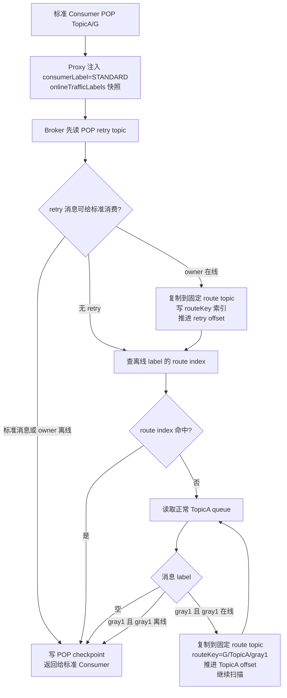
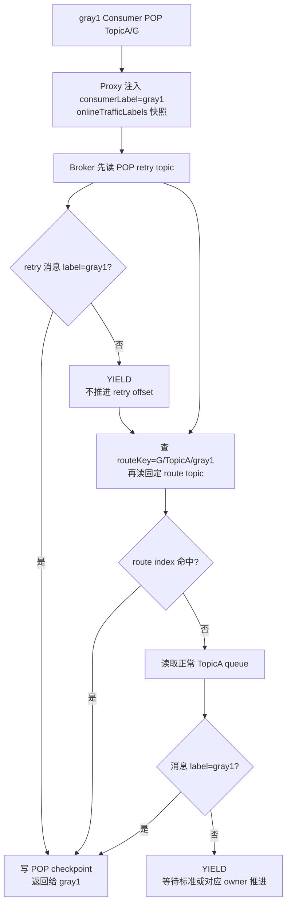

# 流量标动态路由新方案：Proxy/Broker 参考 POP Retry 实现

## 目标

不在客户端实现 fallback Consumer、动态换组或额外订阅。标准环境 Consumer 仍然只对原业务 Topic 和原 consumer group 发起 `ReceiveMessage/POP`；隔离环境 Consumer 也仍然只声明自己的环境流量标。路由、跳过、重试和回退全部在 Proxy 和 Broker 内完成。

这个方案的思路是复用 RocketMQ 现有 POP retry 的服务端透明模型：

- Client/Proxy 请求的仍是原业务 Topic。
- Broker 内部自动读取额外的系统 Topic。
- Broker 返回给客户端前把内部 Topic recode 回原业务 Topic。
- 消息一旦进入 POP checkpoint，后续 ack、change invisible、revive、retry、DLQ 继续走现有链路。

## 与 deferred ledger 方案的区别

这个新方案不引入“原消息 locator + 二级索引”的 deferred ledger。Broker 在需要跳过一条在线隔离环境消息时，直接把完整消息复制到固定的服务端内部路由 Topic，类似 `PopReviveService#reviveRetry` 把未 ack 消息复制到 POP retry topic。

对业务客户端可见的资源仍然不变：

```text
业务 Topic: TopicA
consumerGroup: G

标准 Consumer:
  POP TopicA / G / consumerTrafficLabel=STANDARD

gray1 Consumer:
  POP TopicA / G / consumerTrafficLabel=gray1
```

Broker 内部只创建固定数量的物理 route topic，例如：

```text
RMQ_SYS_TRAFFIC_LABEL_ROUTE_TOPIC
```

`%TLR%G%TopicA%gray1` 这类字符串只表示逻辑 route key，不是物理 Topic：

```text
routeKey = group/topic/messageTrafficLabel
example  = G/TopicA/gray1
```

物理隔离靠固定系统 Topic 的 queue 分片和本地 route index 完成，客户端不订阅、不感知。

## 为什么不按 label 创建物理 Topic

`%TLR%G%TopicA%gray1`、`%TLR%G%TopicA%gray2` 如果是真实 Topic，会带来明显系统成本：

- `topic * consumerGroup * label` 级别的 TopicConfig 膨胀。
- 每个 Topic 都有 consume queue 文件和路由元数据，label 多时文件数和 NameServer 元数据都会放大。
- Broker offset、long polling、统计指标、权限和清理逻辑都会出现大量内部资源。
- label 是动态环境维度，不适合作为物理 Topic 维度。

因此 v1 只允许创建固定系统 Topic，label 只能作为消息属性、route key 和索引前缀。

## 当前源码锚点

现有 POP retry 链路已经提供了可复用模式：

- `proxy/src/main/java/org/apache/rocketmq/proxy/processor/ConsumerProcessor.java:131` 创建 `PopMessageRequestHeader`，这里适合由 Proxy 注入 `consumerTrafficLabel` 和在线 label 快照。
- `proxy/src/main/java/org/apache/rocketmq/proxy/service/message/ClusterMessageService.java:113` 直接把 `PopMessageRequestHeader` 发给 Broker。
- `proxy/src/main/java/org/apache/rocketmq/proxy/service/message/LocalMessageService.java:208` Local 模式也使用同一个 header 调 Broker 的 `PopMessageProcessor`。
- `broker/src/main/java/org/apache/rocketmq/broker/processor/PopMessageProcessor.java:335` POP 请求会自动补偿 POP retry topic 的订阅。
- `broker/src/main/java/org/apache/rocketmq/broker/processor/PopMessageProcessor.java:532` / `:560` Broker 会在一次 POP 中读取 POP retry topic。
- `broker/src/main/java/org/apache/rocketmq/broker/processor/PopMessageProcessor.java:688` `popMsgFromQueue` 是读取具体 queue 的核心入口。
- `broker/src/main/java/org/apache/rocketmq/broker/processor/PopMessageProcessor.java:831` 读取到消息后先写 POP checkpoint。
- `broker/src/main/java/org/apache/rocketmq/broker/processor/PopMessageProcessor.java:850` retry 消息返回前会被 recode 成原业务 Topic。
- `broker/src/main/java/org/apache/rocketmq/broker/processor/PopMessageProcessor.java:972` `appendCheckPoint` 建立 POP in-flight 状态。
- `broker/src/main/java/org/apache/rocketmq/broker/processor/PopReviveService.java:113` `reviveRetry` 把未 ack 消息复制到 POP retry topic，并保留原消息 properties。
- `proxy/src/main/java/org/apache/rocketmq/proxy/service/client/ClusterConsumerManager.java:46` Consumer 注册会广播到其他 Proxy。
- `proxy/src/main/java/org/apache/rocketmq/proxy/service/sysmessage/HeartbeatSyncer.java:107` / `:180` 现有 Proxy heartbeat syncer 已经能同步远端 Consumer 注册和注销。

## 协议字段

在 `PopMessageRequestHeader` 和 `PopLiteMessageRequestHeader` 增加可选字段，旧客户端缺失字段时按标准环境处理：

```java
private String consumerTrafficLabel;
private String onlineTrafficLabels;
private Long trafficLabelSnapshotTime;
private Long trafficLabelSnapshotVersion;
```

含义：

- `consumerTrafficLabel`：当前发起 POP 的 Consumer 环境标。空值归一化为 `STANDARD`。
- `onlineTrafficLabels`：Proxy 在 `group + topic` 维度看到的在线 label 集合，例如 `STANDARD,gray1,gray2`。
- `trafficLabelSnapshotTime`：快照生成时间，Broker 用它判断是否过期。
- `trafficLabelSnapshotVersion`：只用于日志、排查和指标。

Broker 不直接判断全局 Consumer 是否在线。Broker 只相信本次 POP 请求携带的 Proxy 快照；快照缺失或过期时，状态按 `UNKNOWN` 处理，标准环境不做 fallback。

## Proxy 侧实现

Proxy 不改变客户端订阅模型，只在服务端请求头上补字段。

### Consumer label 来源

Java 5.x gRPC Consumer 建连或发送 settings 时，把环境流量标传给 Proxy。Proxy 将它绑定到当前 `ClientChannelInfo` 或 Channel extend attribute 上。

现有 `ClientChannelInfo` 没有扩展属性字段，最小改法有两个：

1. 在 Proxy 侧维护一个 `TrafficLabelPresenceManager`，key 使用 `clientId/channel/group/topic`，不改 `ClientChannelInfo`。
2. 扩展 Proxy 的 channel extend attribute，让 `RemoteChannel` 同步时也携带 label。

推荐 v1 用第 1 种，少改公共 broker client 类型。

### 多 Proxy 在线视图

复用现有 `ClusterConsumerManager + HeartbeatSyncer`：

```text
ClusterConsumerManager.registerConsumer
  -> TrafficLabelPresenceManager.upsertLocal(group, topics, trafficLabel, channel)
  -> HeartbeatSyncer 广播 Consumer 注册
  -> super.registerConsumer(...)

HeartbeatSyncer.consumeMessage(remote register)
  -> consumerManager.registerConsumer(..., false)
  -> TrafficLabelPresenceManager.upsertRemote(group, topics, trafficLabel, remoteChannel)
```

需要扩展 `HeartbeatSyncerData`，把 `trafficLabel` 一起广播。现有 `HeartbeatSyncer` 已经同步 `subscriptionDataSet`，所以可以按订阅 topic 建立：

```text
group/topic/trafficLabel -> active lease count
group/topic -> onlineTrafficLabels
```

### POP 请求注入

在 `ConsumerProcessor#popMessage` 创建 `PopMessageRequestHeader` 后补充：

```java
requestHeader.setConsumerTrafficLabel(
    presenceManager.getConsumerTrafficLabel(ctx.getClientID(), consumerGroup, topic));

TrafficLabelSnapshot snapshot =
    presenceManager.snapshot(consumerGroup, topic);

requestHeader.setOnlineTrafficLabels(snapshot.encodeLabels());
requestHeader.setTrafficLabelSnapshotTime(snapshot.getTimestamp());
requestHeader.setTrafficLabelSnapshotVersion(snapshot.getVersion());
```

`ClusterMessageService` 和 `LocalMessageService` 不需要理解这些字段，只转发 header。

## Broker 侧核心路由

### 路由判定

```text
messageLabel = normalize(message.properties["__RMQ_TRAFFIC_LABEL"])
consumerLabel = normalize(requestHeader.consumerTrafficLabel)

if messageLabel == STANDARD:
    if consumerLabel == STANDARD:
        return DELIVER
    else:
        return YIELD

if messageLabel == consumerLabel:
    return DELIVER

if consumerLabel == STANDARD:
    if owner label offline in fresh snapshot:
        return DELIVER_FALLBACK
    else:
        return MOVE_TO_TRAFFIC_ROUTE_TOPIC

else:
    return YIELD
```

这里刻意不让隔离 Consumer 搬运标准消息，也不让 `gray2` 搬运 `gray1` 消息。这样可以避免“10 个隔离 Consumer 扫到大量标准消息，全部写内部 Topic”的放大问题。标准消息只由标准 Consumer 推进；在线隔离消息只在标准 Consumer 碰到时被复制到固定 route topic，并写入对应 label 的 routeKey 索引。

### 标准 Consumer 的完整读取顺序

标准 Consumer 客户端仍然只请求 `TopicA/G`。Broker 内部按下面顺序取消息：

```text
1. 读取 G + TopicA 的 POP retry topic
   - 如果 retry 消息 label 为空，直接投递给标准 Consumer。
   - 如果 retry 消息 label=gray1 且 gray1 离线，fallback 投递给标准 Consumer。
   - 如果 retry 消息 label=gray1 且 gray1 在线，复制到 `RMQ_SYS_TRAFFIC_LABEL_ROUTE_TOPIC`，routeKey=`G/TopicA/gray1`，然后推进 retry topic offset。

2. 查询可 fallback 的 route index
   - 根据在线快照，只查离线 label 的 routeKey。
   - 例如 gray1 在线、gray2 离线，只查 `G/TopicA/gray2`，再按索引定位到 `RMQ_SYS_TRAFFIC_LABEL_ROUTE_TOPIC` 中的真实消息。

3. 读取正常 TopicA consume queue
   - 标准消息直接投递。
   - gray1 消息且 gray1 在线，复制到 `RMQ_SYS_TRAFFIC_LABEL_ROUTE_TOPIC`，routeKey=`G/TopicA/gray1`，推进 TopicA offset，继续扫描。
   - gray1 消息且 gray1 离线，直接 fallback 投递给标准 Consumer。
```

标准 Consumer 不会订阅隔离 Topic，也不会用另一个 group。所有内部 Topic 读取都由 Broker 在 `PopMessageProcessor` 里透明完成。

### 隔离 Consumer 的完整读取顺序

`gray1` Consumer 客户端仍然只请求 `TopicA/G`。Broker 内部按下面顺序取消息：

```text
1. 读取 G + TopicA 的 POP retry topic
   - label=gray1，投递给 gray1。
   - label 为空或其他 label，YIELD，不推进。

2. 查询 route index 的 `G/TopicA/gray1` 前缀，并从 `RMQ_SYS_TRAFFIC_LABEL_ROUTE_TOPIC` 读取原消息
   - 这些都是之前被标准 Consumer 遇到但当时 gray1 在线的消息。
   - 投递给 gray1。

3. 读取正常 TopicA consume queue
   - label=gray1，投递给 gray1。
   - label 为空，YIELD，等待标准 Consumer 消费并推进 group offset。
   - label=gray2，YIELD，等待 gray2 或标准 fallback 处理。
```

这保留了同一个 consumer group 的竞争语义：谁能推进正常队列 offset，由 Broker 的 queue lock 和路由判定共同决定。

## 固定 Route Topic 的写入

Route topic 的写入参考 `PopReviveService#reviveRetry`，复制完整消息体和 properties，不只保存原业务消息 locator。

```text
routeTopic = RMQ_SYS_TRAFFIC_LABEL_ROUTE_TOPIC
routeKey   = KeyBuilder.buildTrafficLabelRouteKey(originTopic, group, messageLabel)
queueId    = positiveHash(routeKey) % trafficLabelRouteTopicQueueNums
```

`messageLabel` 进入 route key 前需要做安全编码或哈希截断，避免特殊字符和超长 label 破坏索引 key。

写入消息时保留原始属性，并补充内部属性：

```text
__RMQ_TRAFFIC_LABEL_ROUTE_KEY = G/TopicA/gray1
__RMQ_TRAFFIC_LABEL_ORIGIN_TOPIC = TopicA
__RMQ_TRAFFIC_LABEL_ORIGIN_GROUP = G
__RMQ_TRAFFIC_LABEL_MESSAGE_LABEL = gray1
__RMQ_TRAFFIC_LABEL_ORIGIN_QUEUE_ID = 3
__RMQ_TRAFFIC_LABEL_ORIGIN_QUEUE_OFFSET = 1024
__RMQ_TRAFFIC_LABEL_ROUTE_SOURCE = NORMAL | POP_RETRY
```

写入顺序：

```text
1. POP 从 normal topic 或 POP retry topic 读取到候选消息。
2. Broker 判定 route action = MOVE_TO_TRAFFIC_ROUTE_TOPIC。
3. Broker 复制完整消息到 RMQ_SYS_TRAFFIC_LABEL_ROUTE_TOPIC 的固定分片 queue。
4. 写入成功后，把 routeKey + routeTopic queueId/queueOffset 写入本地 route index。
5. 系统 Topic 和本地索引都成功后，才允许推进源 topic 的 POP cursor。
6. 任一步失败时，不推进源 offset，当前 queue 停止扫描。
```

这和 retry 的取舍一致：不做跨 Topic 事务，优先保证不丢消息；极端崩溃窗口允许重复投递。

本地 route index 是固定系统 Topic 的热查询索引，不是按原业务消息 locator 设计的 deferred ledger：

```text
routeIndex:
  brokerName/group/originTopic/messageTrafficLabel/routeQueueId/routeQueueOffset -> route record

route record:
  routeTopic = RMQ_SYS_TRAFFIC_LABEL_ROUTE_TOPIC
  routeQueueId
  routeQueueOffset
  originTopic
  originGroup
  messageTrafficLabel
  routeSource
```

索引源数据是 `RMQ_SYS_TRAFFIC_LABEL_ROUTE_TOPIC` 中的完整消息。Broker 重启或索引丢失时，可以重放固定系统 Topic 重建索引；已进入 POP checkpoint 的 route 消息在 index 中删除，后续失败恢复交给 POP retry。

## `popMsgFromQueue` 需要怎么改

当前 `popMsgFromQueue` 在 `getMessageAsync` 返回 `GetMessageResult` 后，直接对整个 result 写 checkpoint 并返回。流量标路由不能这么做，因为一个 batch 里可能混有：

```text
offset 10: gray1，需要移动到 route topic
offset 11: 标准消息，可以投递给标准 Consumer
offset 12: gray2，需要移动或停止
```

需要在 `appendCheckPoint` 前增加一个 route filter 阶段：

```text
rawResult = messageStore.getMessageAsync(...)
routedResult = trafficLabelRouteManager.route(rawResult, requestContext)

if routedResult.hasDeliverMessages():
    appendCheckPoint(..., routedResult.deliverResult, routedResult.nextBeginOffset)
    add deliver messages to response

if routedResult.onlyMovedMessages():
    popBufferMergeService.addCkMock(..., routedResult.nextBeginOffset)

if routedResult.hitYieldOrMoveFailure():
    do not advance beyond that offset
```

`route(...)` 按 queue offset 顺序处理候选消息：

```text
for message in rawResult ordered by queueOffset:
    action = routeAction(message, requestContext)

    if action == DELIVER or action == DELIVER_FALLBACK:
        deliverResult.add(message)
        nextBeginOffset = message.queueOffset + 1
        continue

    if action == MOVE_TO_TRAFFIC_ROUTE_TOPIC:
        if appendRouteTopic(message):
            nextBeginOffset = message.queueOffset + 1
            continue
        else:
            stop at message.queueOffset
            break

    if action == YIELD:
        stop at message.queueOffset
        break
```

`appendCheckPoint` 需要允许传入 `nextBeginOffset`，不要直接使用原始 `GetMessageResult#getNextBeginOffset()`。否则会错误推进到 batch 尾部，导致还没处理的消息被越过。

## Route Index 的读取和返回

固定 route topic 要像 POP retry topic 一样只被 Broker 内部读取，不暴露给客户端。区别是不能让每个 label Consumer 扫全量 `RMQ_SYS_TRAFFIC_LABEL_ROUTE_TOPIC`，必须先查 route index。

读取入口可以沿用 `popMsgFromTopic(...)` / `popMsgFromQueue(...)`，但要增加一个 topic 类型：

```text
NORMAL
POP_RETRY
TRAFFIC_ROUTE
```

读取步骤：

```text
1. 根据当前 consumerLabel 和在线快照选 routeKey：
   - gray1 Consumer: 只查 G/TopicA/gray1。
   - 标准 Consumer: 只查 STANDARD 和离线 label 的 routeKey。
2. 用 routeKey 前缀查 route index，得到 routeTopic queueId/queueOffset。
3. 从 RMQ_SYS_TRAFFIC_LABEL_ROUTE_TOPIC 读取完整消息。
4. 重新执行 subscription filter 和流量标路由判定。
5. 写 POP checkpoint 成功后，从 route index 删除该 record。
```

当 `TRAFFIC_ROUTE` 消息返回给客户端时：

- `appendCheckPoint` 使用真实的 `RMQ_SYS_TRAFFIC_LABEL_ROUTE_TOPIC`、queueId 和 queueOffset，保证 ack/change invisible 能找到实际 offset。
- Broker 响应体中把 message topic recode 成原业务 Topic。
- `PROPERTY_POP_CK` / `ExtraInfoUtil` 需要能表达真实 topic 是 traffic route topic，类似现在的 `RETRY_TOPIC` / `RETRY_TOPIC_V2`。

这部分对应当前 retry recode 逻辑：

```text
PopMessageProcessor:
  if actual topic is retry and !popResponseReturnActualRetryTopic:
      build POP_CK with actual retry topic
      messageExt.setTopic(requestHeader.getTopic())
```

新增 route topic 后，逻辑变成：

```text
if actual topic is retry or traffic route:
    build POP_CK with actual internal topic
    messageExt.setTopic(originTopic)
```

## 未 ack 后怎么走 retry

如果 routeKey=`G/TopicA/gray1` 的消息投递给 `gray1` 后未 ack：

```text
t0: Broker 从 RMQ_SYS_TRAFFIC_LABEL_ROUTE_TOPIC 投递消息，并写 POP checkpoint。
t1: gray1 Consumer 未 ack。
t2: invisible time 到期。
t3: PopReviveService 处理 checkpoint。
t4: Broker 不应该写入 RMQ_SYS_TRAFFIC_LABEL_ROUTE_TOPIC 自己的 retry topic。
t5: Broker 应写入 G + TopicA 的 POP retry topic，并保留 __RMQ_TRAFFIC_LABEL=gray1。
t6: 下一次 POP 重新按最新在线快照判定：
    - gray1 在线：投递给 gray1。
    - gray1 离线：标准 Consumer fallback。
```

因此 `PopReviveService#reviveRetry` 要增加 route topic 特判：

```text
if checkpoint.topic == RMQ_SYS_TRAFFIC_LABEL_ROUTE_TOPIC:
    originTopic = message property __RMQ_TRAFFIC_LABEL_ORIGIN_TOPIC
    retryTopic = KeyBuilder.buildPopRetryTopic(originTopic, group, enableRetryTopicV2)
else if checkpoint.topic startsWith retry prefix:
    retryTopic = checkpoint.topic
else:
    retryTopic = KeyBuilder.buildPopRetryTopic(checkpoint.topic, group, enableRetryTopicV2)
```

这样 route topic 只是“路由跳过缓冲”，不是消费失败重试队列。消费失败仍回到 RocketMQ 现有 POP retry 体系。

## 普通消息、FIFO、延迟、事务

### 普通非 FIFO 消息

使用完整方案：

- 标准 Consumer 碰到在线隔离 label，复制到固定 route topic，写入对应 routeKey 索引，并推进原 queue offset。
- 隔离 Consumer 按自己的 routeKey 从 route index 定位 route topic 消息，或从正常 topic 读取。
- 标准 Consumer 在 label 离线时可从正常 topic、POP retry topic、route topic fallback 消费。

### FIFO 消息

不写 route topic，不跳过队头。

当前 `PopMessageRequestHeader#order` 注释已经说明 order POP 不走普通 retry/checkpoint 模型。FIFO 场景如果队头不属于当前 Consumer：

```text
owner 在线或状态未知:
  返回空结果，不推进 offset。

owner 离线且当前是标准 Consumer:
  fallback 消费队头。
```

原因是把 FIFO 队头搬到 route topic 会破坏原队列顺序。

### 延迟消息

延迟未到期前不做消费路由。Timer 到期后消息进入真实业务 Topic，再按普通非 FIFO 或 FIFO 规则处理。Producer 写入的 `__RMQ_TRAFFIC_LABEL` 必须随消息属性保留到最终投递消息。

### 事务消息

Half message 不做消费路由。事务 commit 后写入真实业务 Topic 的消息携带 `__RMQ_TRAFFIC_LABEL`，之后按普通规则处理。rollback 的消息不可见，不参与路由。

## 多 Proxy、多 Broker Master

多 Proxy：

- 在线 label 由 Proxy 集群视图生成，不由 Broker 本地连接推断。
- 扩展 `HeartbeatSyncerData` 同步 `trafficLabel`。
- 每次 POP header 携带 `onlineTrafficLabels + snapshotTime`。
- Broker 快照过期时 fail closed：标准 Consumer 不 fallback 隔离消息。

多 Broker Master：

- 每个 queue 只由所在 Broker Master 处理 POP，现有 `QueueLockManager` 仍按 `topic + group + queueId` 串行化本 Broker 上的同队列 POP。
- 固定 route topic 写在同一个 Broker 上，按内部 Topic 正常复制和 HA。
- 如果 Broker 在“route topic 写成功，但源 offset mock checkpoint 未提交”之间崩溃，恢复后可能重复复制或重复投递；这是 at-least-once，可接受。
- 如果 route topic 写失败，源 offset 不推进，消息不会丢。

## 性能边界

这个方案用“固定内部 Topic 全量复制 + route index”替代 deferred ledger 的“原消息 locator + index”。优点是实现更贴近现有 POP retry，route topic 自带完整消息体，不依赖原 commitlog 保留；缺点是 route miss 会复制消息 body，写放大比 deferred ledger 高。

关键性能保护：

- 只有标准 Consumer 碰到在线隔离消息时才写 route topic。
- 隔离 Consumer 碰到标准消息只 `YIELD`，不写 route topic。
- 物理 route topic 固定队列数，不按 label 创建 Topic。
- route index 按 `group/topic/label` 前缀隔离，`gray1` Consumer 只查 `G/TopicA/gray1`，不会扫描 `gray2`。
- 标准 Consumer 只查离线 label 的 routeKey，不查在线 label 的 backlog。
- 每次 POP 限制最多检查的 route labels，例如 `trafficLabelRouteMaxLabelsPerPop=16`。
- 对单个 `group/topic/label` routeKey 设置积压告警和限流；达到上限时，标准 Consumer 停止继续搬运该 label，源 queue 回到阻塞状态。

这个取舍适合隔离 label 数量十几个以内、消息体大小可控的场景。如果隔离 label 非常多或被跳过消息体很大，deferred ledger 的 locator 模式会更省磁盘和网络。

## 最小改动清单

1. `MessageConst` 增加 `PROPERTY_TRAFFIC_LABEL` 和 route origin 相关内部属性。
2. `KeyBuilder` 增加 `buildTrafficLabelRouteKey`、`isTrafficLabelRouteTopic`、`parseTrafficLabelRouteMessageOrigin`。
3. `PopMessageRequestHeader` / `PopLiteMessageRequestHeader` 增加 consumer label 和在线快照字段。
4. Proxy 增加 `TrafficLabelPresenceManager`，并扩展 `HeartbeatSyncerData` 同步 label。
5. `ConsumerProcessor#popMessage` / lite POP 生成 header 时写入 label 快照。
6. `PopMessageProcessor#processRequest` 构造 `TrafficLabelRouteContext`。
7. Broker 增加固定 `RMQ_SYS_TRAFFIC_LABEL_ROUTE_TOPIC` 和本地 route index。
8. `PopMessageProcessor` 在读取 POP retry、traffic route、normal topic 时统一调用 route gate。
9. `popMsgFromQueue` 在 `appendCheckPoint` 前增加 batch route filter，并支持 `nextBeginOffset` 来自过滤结果。
10. `PopMessageProcessor` 响应 route topic 消息时像 retry 消息一样 recode 为原业务 Topic。
11. `ExtraInfoUtil` 增加 traffic route topic 标记，使 ack/change invisible 使用真实 route topic。
12. `PopReviveService#reviveRetry` 对 route topic checkpoint 特判，未 ack 后写回原业务 Topic 的 POP retry topic。
13. 增加指标：
    - `traffic_label_route_move_total{topic,group,label,source}`
    - `traffic_label_route_topic_backlog{topic,group,label}`
    - `traffic_label_route_yield_total{topic,group,consumerLabel,messageLabel}`
    - `traffic_label_route_snapshot_stale_total{topic,group}`
    - `traffic_label_route_move_failed_total{topic,group,label}`

## 标准 Consumer 消费流程



## gray1 Consumer 消费流程


