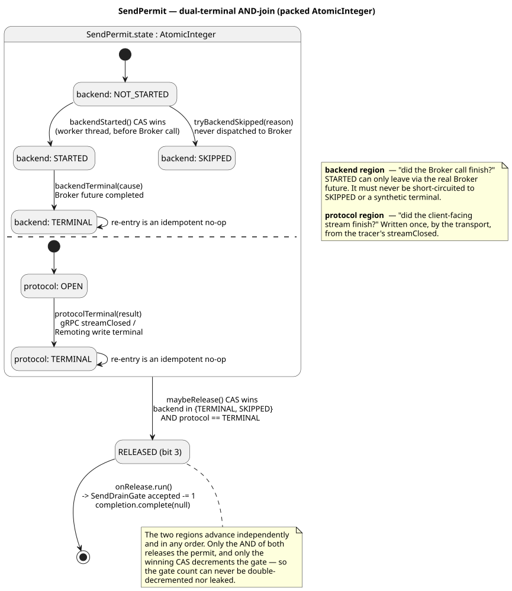
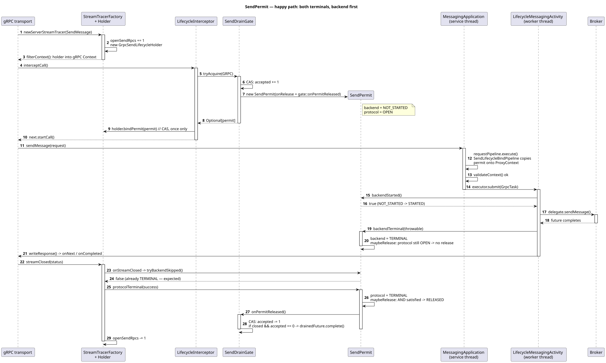
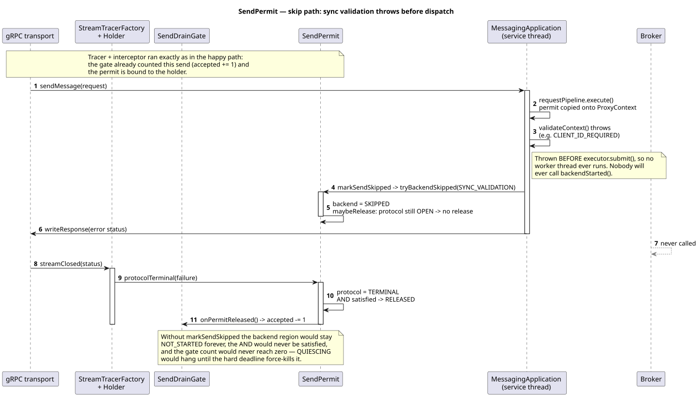
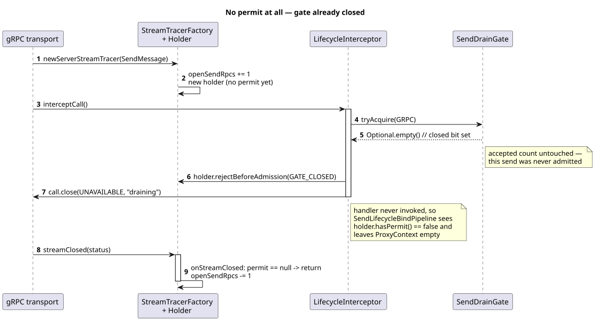

# SendPermit —— 单次发送的双终态记账凭证

> 代码:`proxy/src/main/java/org/apache/rocketmq/proxy/lifecycle/SendPermit.java`
> 配图源文件:`diagrams/send-permit.puml`,渲染结果在 `diagrams/svg/sendpermit-*.{svg,png}`
> 本文只讲 SendPermit 及其直接协作者。整体状态机见 `state-transitions.md`。

## 1. 它解决什么问题

优雅下线的核心动作在 `ProxyLifecycleCoordinator`:

```java
transition(MIGRATING, DRAINING, "draining");
gate.closeAdmission();        // :325 —— 之后不再放行新的 send
return gate.drainedFuture();  // :326 —— 等在途 send 归零
```

`closeAdmission()` 之后不再发放新凭证,然后**等 `accepted` 计数归零**才认为「业务已排空」。所以每张已发放的凭证必须、且只能被释放一次:

- **漏放一次** → 计数永不归零 → QUIESCING/DRAINING 一直挂到硬超时被 `forceDrain` 强杀,优雅下线退化成强杀。
- **多放一次** → 计数提前归零 → 还在飞的请求被当成已完成,进程可能在 Broker 写入未落地时就被关掉。

`SendPermit` 就是这张凭证。它的唯一职责是:**判断一次发送在生命周期意义上是否彻底结束,并在结束的那一刻恰好一次地把 `SendDrainGate` 的在途计数减 1**。它不是业务发送结果,不能用来判断消息是否已被 Broker 接受。

## 2. 为什么必须是「双终态」

一次 send 有两条**独立的**完成线,跑在不同线程、完成顺序不确定:

| 区 | 含义 | 谁来写 |
|---|---|---|
| **backend** | send delegate dispatch attempt 是否已终态（包括本地/同步失败）? | worker 线程,`SendLifecycleMessagingActivity.java:74,81` |
| **protocol** | 面向客户端的 gRPC 流关闭了吗? | 传输层,经 `GrpcSendLifecycleHolder.onStreamClosed`(`:64-71`) |

只看其中任意一条都会出错:

- **只看 protocol**:客户端取消或断连时流立刻关闭,但 Broker 调用还在飞。此时就减计数等于「提前宣布排空」。
- **只看 backend**:请求在 dispatch 之前就被拒了(校验抛异常、闸门已关),压根没有 Broker 调用,backend 永远等不到终态。

所以 `maybeRelease()` 做的是两者的 **AND**(`SendPermit.java:135`)。



图中那条水平虚线是并发分区分隔线:上半区 backend、下半区 protocol,各自独立推进,只有汇合才落到 RELEASED,再由 RELEASED 触发 `onRelease.run()` 去减闸门计数。

## 3. 三个实现细节

### 3.1 打包进一个 `AtomicInteger`

```java
// backend: bits 0-1
private static final int BACKEND_MASK        = 0b11;
private static final int BACKEND_NOT_STARTED = 0;
private static final int BACKEND_STARTED     = 1;
private static final int BACKEND_TERMINAL    = 2;
private static final int BACKEND_SKIPPED     = 3;
// protocol: bit 2
private static final int PROTOCOL_TERMINAL   = 1 << 2;
// released: bit 3
private static final int RELEASED            = 1 << 3;
```

两区状态 + released 标志共处一个整数(`:33-41`),于是「检查 AND 条件」和「抢占 released 标志」是**同一次 CAS 里的原子决策**(`:146-147`)。不存在「两个线程都看到两边已终态、于是各减一次」。只有赢下 `RELEASED` 位那次 CAS 的线程才会调 `onRelease.run()`。

### 3.2 backend 三个出口,前提各不相同

`backendStarted()`(`:71-82`)—— 赢 CAS 才返回 `true`,语义是「worker 已取得 send delegate dispatch attempt 的所有权」。`SendLifecycleMessagingActivity` 只有拿到 `true` 才能调用 delegate；输掉 CAS 时既不调用 delegate,也不伪造成功响应,而是返回显式失败的 future。delegate 内仍可能在访问 Broker 前发生本地校验或同步失败,所以 STARTED 不代表 Broker RPC 已经发出。这样即使流关闭通知和 worker dispatch 发生竞争,也不会留下一个永不完成、无法诊断的 response future。

`backendTerminal(cause)`(`:85-102`)—— **只能从 STARTED 来**,从别的状态调会主动抛异常:

```java
if (b != BACKEND_STARTED) {
    throw new IllegalStateException(
        "backendTerminal is only valid from STARTED, current backend=" + b);
}
```

这是故意「响亮地失败」而非静默修补:状态机被写坏了必须暴露出来。

delegate 同步抛异常或错误地返回 `null` future 时,decorator 也会立刻调用 `backendTerminal(cause)` 并返回 exceptional future,避免 permit 卡在 STARTED。

`tryBackendSkipped(reason)`(`:105-117`)—— **只允许 `NOT_STARTED → SKIPPED`**。已经 STARTED 就返回 `false`,表示 worker 已取得 delegate dispatch attempt 的所有权,不能再把它改写成 skipped；此后无论 delegate 真正发出 Broker RPC、同步失败还是错误地返回 `null`,都必须由 decorator 写入 `backendTerminal`。**竞争失败是正常结果,不是错误** —— 接口注释也是这么写的(`SendLifecycleContext.java:35`)。

### 3.3 释放通知不是业务成功

`releasedFuture()` 只在 RELEASED 时完成,语义是「生命周期记账已经释放」。它无论 backend/protocol 的结果是成功还是失败都会正常完成,因为 drain 只关心这笔在途工作是否结束。旧的 `completionFuture()` 只作为 deprecated compatibility alias 保留,语义与 `releasedFuture()` 完全相同。

因此这条 future 是 **liveness/release signal**,绝不能拿它构造客户端的 `SendMessageResponse`,更不能把「完成」解释成 `Code.OK`。生产路径的业务成功最终只能来自 `SendMessageActivity` 把 Broker 返回的 `SendStatus.SEND_OK` 映射成 `SendMessageResponse.status.code == Code.OK`。

## 4. 关键真实路径

### 4.1 正常路径:backend 先终态,protocol 后到



关键几步:

- 第 2 步 tracer 在**拦截器之前**就创建 holder 并 `openSendRpcs += 1`,通过 `filterContext` 注入 gRPC Context(`GrpcSendStreamTracerFactory.java:70-72`)。
- 第 6-7 步 `tryAcquire` 的成功 CAS 就是**准入线性化点**:计数先加,再造 permit(`SendDrainGate.java:63-65`)。
- 第 12 步 `SendLifecycleBindPipeline` 在**service 线程**上把 permit 拷到 `ProxyContext`。必须在这里做,因为 worker 线程看不到 gRPC Context。
- `GrpcSendLifecycleHolder` 同时允许相反顺序:如果 tracer 的 `streamClosed` 先于 interceptor 的 `bindPermit`,`protocolTerminal` 会先锁存首个 `ProtocolResult`；permit 绑定后,`protocolTerminalDelivered` 的 CAS 再恰好一次地补写 `tryBackendSkipped` 与 `protocolTerminal`。两边在各自 CAS 成功后都会调用 `deliverProtocolTerminalIfReady`,所以 bind/close 任意顺序都能收敛。`protocolTerminal` 放在 `finally` 中交付,即使 skip 回调异常也不会丢终态。
- `SendLifecycleMessagingActivity` 返回的是由 send delegate future 派生、带 `backendTerminal` 回调的 response-visible completion stage。正常生产路径中,这个 delegate 的成功响应由 Broker `SEND_OK` 构造。下游 `writeResponse` 只能在该 stage 之后观察响应；生命周期回调若异常,该 stage 也必须异常完成,不能越过回调继续回成功。
- 第 20 步 backend 到 TERMINAL 时 `maybeRelease` 因 protocol 还 OPEN **不释放**。
- 第 23-24 步:tracer 关流时也会试一次 `tryBackendSkipped`,返回 `false` 是**预期行为**,不是错误。
- 第 26-28 步 protocol 终态到位,AND 满足 → RELEASED → 计数减 1;若此时闸门已关且计数归零,`drainedFuture` 完成。

### 4.2 跳过路径:同步校验在 dispatch 前抛异常



`GrpcMessagingApplication.addExecutor` 先在 service 线程跑 pipeline + `validateContext()`,**再** `executor.submit()`。异常发生在 submit 之前,worker 永不运行,没人会调 `backendStarted()` —— backend 会停在 NOT_STARTED。

这里的 catch 只负责把校验错误写回客户端,**不会**直接调用 `markSendSkipped`。流随后关闭时,`GrpcSendLifecycleHolder` 的 canonical terminal delivery 会依次执行:

```java
lifecycle.tryBackendSkipped(SkipReason.STREAM_CLOSED_BEFORE_DISPATCH);
lifecycle.protocolTerminal(protocolResult);
```

第一句把 backend 从 NOT_STARTED 推到 SKIPPED,第二句补齐 protocol terminal,两者汇合后才释放 permit。`tryBackendSkipped` 的 CAS 仍然很重要:若 worker 已经赢得 `backendStarted()`,它会退化成无害的 `false`,系统继续等待该 delegate dispatch attempt 的真实 terminal(成功、异步失败或同步失败均可)。

close-before-bind 的终态锁存也覆盖更早的取消:即使 tracer 先看到 `streamClosed`,terminal 也不会因当时 `permit == null` 而被永久丢弃。

### 4.2.1 同一形状:线程池拒绝

生产代码中显式调用 `markSendSkipped` 的位置是 `GrpcTaskRejectedExecutionHandler.rejectedExecution`:

```java
GrpcTask grpcTask = castGrpcTask(r);
if (grpcTask != null) {
    try {
        markSendSkipped(grpcTask.context);
        writeResponse(grpcTask.context, grpcTask.request, grpcTask.executeRejectResponse, ...);
```

这条路径与 4.2 的形状完全相同:`submit()` 本身成功了,但任务被队列满拒绝,`run()` 永不执行 → 没人调 `backendStarted()` → backend 永久停在 NOT_STARTED。所以拒绝处理器也必须补一次 SKIPPED。

这里有个坑值得记一笔:`submit()` 会把任务包进 `FutureTaskExt`,所以裸的 `instanceof GrpcTask` 永远不匹配 —— 必须经 `castGrpcTask` 解包(`:538-553`)。漏了这一步,拒绝路径上的 permit 就会静默泄漏。

注意这条路径复用了 `markSendSkipped`,因此上报的原因也是 `SYNC_VALIDATION`,而不是语义更贴切的 `EXECUTOR_REJECTED`。由于原因当前根本没被消费(见第 6 节),这不影响正确性。

### 4.3 无凭证路径:闸门已关



`tryAcquire` 返回 `Optional.empty()`(`SendDrainGate.java:56-58`),**计数完全没动过**,也就没有任何东西需要释放。拦截器只在 holder 上记一个 `rejectBeforeAdmission(GATE_CLOSED)` 并以 `UNAVAILABLE` 关闭调用,业务 handler 从不被调用(`GrpcSendLifecycleInterceptor.java:76-83`)。

这条路对应 `SendLifecycleBindPipeline.java:39` 里 `holder.hasPermit()` 为 `false` 的分支 —— 不往 `ProxyContext` 写,下游看到 `getSendLifecycleContext() == null` 就完全不做生命周期记账。

`LATE_TRANSPORT`(连接在 lb cutoff 之后才建立,`:67-74`)走的是同一形状的路径。

### 4.4 `Code.OK` 的因果边界

生命周期完成与业务发送成功必须是两条不同的信号。实现用下面几层约束保证「没有 Broker 成功结果,就不能向客户端返回 `Code.OK`」:

1. 闸门已关或 late transport 时,interceptor 直接以 gRPC `UNAVAILABLE` 结束调用,业务 handler 和 Broker delegate 都不会运行。
2. permit 已被 skip、`backendStarted()` 返回 `false` 时,decorator 不调用 Broker,并返回 exceptional future,不会生成成功 payload。
3. delegate 同步抛错、返回 `null` future 或 delegate future 异常完成时,客户端可见的 stage 都是 exceptional；正常 delegate future 则先经过 `backendTerminal` 所在的 `whenComplete` stage,下游才有机会写 response。
4. `ResponseBuilder.buildStatus(Throwable)` 对异常路径做最后一道防御:即使异常错误地携带 `Code.OK` 或 `ResponseCode.SUCCESS`,也强制降为 `INTERNAL_SERVER_ERROR`。异常永远不能被编码成业务成功。

因此要区分两种“成功”:gRPC transport 可能正常结束,但 payload status 是校验/限流等业务错误；真正的 send 成功必须是 `SendMessageResponse.status.code == Code.OK`。生产实现中的最终因果边界是 `SendMessageActivity`:只有 Broker 返回 `SendStatus.SEND_OK` 时它才构造 `Code.OK`。

强制排空结果同样是 sticky outcome:即使生命周期状态随后推进到 `STOPPING/STOPPED`,admin JSON 仍保留 `"forced":true`,`mqproxyctl drain --wait` 会继续返回非零,不会把最终 `STOPPED` 误判成一次优雅排空成功。

## 5. 装配关系

`ProxyGracefulLifecycleWiring` 里 `SendDrainGate` 是单例(`:41`),同时交给拦截器(`:55`)和 coordinator(`:97`);`openSendRpcs` 计数器交给 tracer factory(`:54`)。

这套 send 记账由 `enableProxySendDrain` 显式控制,默认值为 `false`,且只能在
`enableProxyGracefulLifecycle=true` 时开启。关闭时不会安装 send tracer/interceptor、
`SendLifecycleBindPipeline` 或 `SendLifecycleMessagingActivity`;连接迁移、transport
filter 和非 unary active-call drain 仍工作,但系统不再声称具备 accepted-send
双终态排空保证。需要该保证的严格生产配置必须显式设置
`enableProxySendDrain=true`。

```
GrpcSendStreamTracerFactory ──创建──▶ GrpcSendLifecycleHolder ──存放──▶ SendPermit
          │                                   ▲                            ▲
       注入 gRPC Context                   bindPermit                   tryAcquire
          │                                   │                            │
          ▼                    GrpcSendLifecycleInterceptor ──────▶ SendDrainGate
   SendLifecycleBindPipeline                                              │
          │ 拷到 ProxyContext                                      closeAdmission /
          ▼                                                        drainedFuture
   SendLifecycleMessagingActivity ──backendStarted/backendTerminal──▶ SendPermit
```

注意 `openSendRpcs`(tracer 维护)和 `SendDrainGate.accepted`(闸门维护)是**两个不同的计数**:前者从 tracer 创建到流关闭,覆盖被拒和同步失败的 send;后者只统计真正被准入的 send,是 drain 判据。

## 6. 诚实标注:尚未接线的部分

- **`SkipReason` 目前只是形参**。`SendPermit.tryBackendSkipped` 和 `GrpcSendLifecycleHolder.rejectBeforeAdmission` 都没有把它存下来或打日志,因此「原因更精确」当前只体现在代码可读性上,运行时观测不到区别。
- **`SendProtocol.REMOTING` 未接线**。`SendPermit` 支持 `protocol()` 区分协议,但全仓库只有 gRPC 侧调用 `tryAcquire(SendProtocol.GRPC)`,Remoting 侧的 send 尚未纳入该闸门。
- **`SendPermit.protocol()` 无任何读者**(生产和测试都没有),它是为上一条的 Remoting 接入预留的。`GrpcSendLifecycleHolder.permit()` 则有生产读者,即 `SendLifecycleBindPipeline.java:40`。
